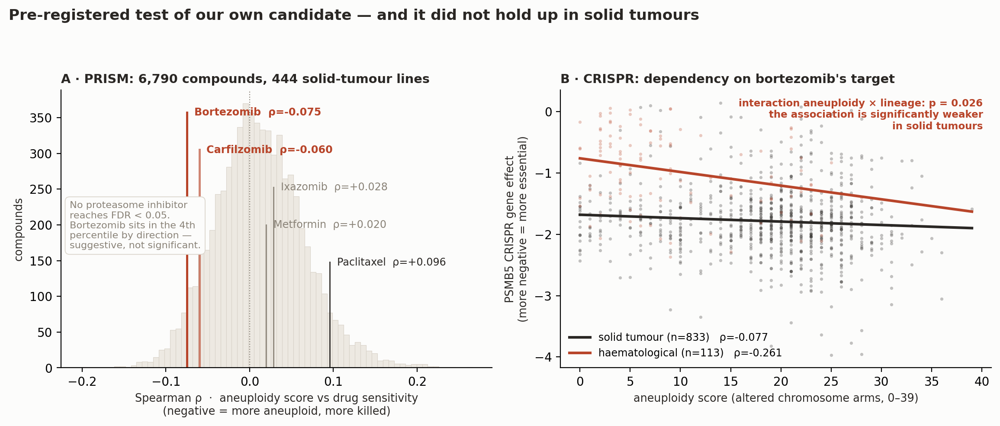
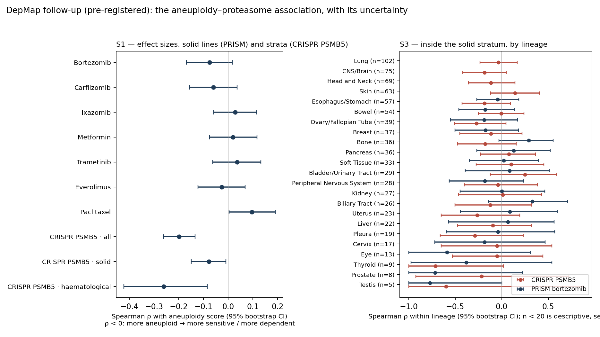

# Track 2 — Drug Repurposing for MVA1 (BUB1B, presumed compound heterozygosity; phase not established)

**Team: ciberpty** · Rare Disease, Real Kid: MVA Hackathon 2026
Repository: https://github.com/cpu-16/mva-hackathon-2026 · Methods description: Appendix B of this PDF (`submission/ciberpty_track2_methods.md` in the repository)

---

## Read this first — one page for the family and the treating team

*Plain-language summary, placed first on purpose. The rest of this report is written for scientists;
this page is written for the child's parents and for the clinician sitting with them. Every claim in it
is sourced in the sections that follow.*

### What we looked for

An existing, already-approved medicine that could help a child with mosaic variegated aneuploidy caused
by two changes in the *BUB1B* gene. We set out in advance the tests a candidate had to pass, and we put
the main candidates the scientific literature points to through them. **This is not an exhaustive
screen of every proposed agent**, and §8 lists what we ruled out and why.

### What we are **not** recommending

**No drug should be started for this today.** We want to be direct about that, because the honest answer
is more useful than an encouraging one.

- **Metformin** is the medicine most often suggested for this kind of problem. It should not be started
  on this reasoning: no one has measured what dose would be needed to act on *this* problem. The
  best-studied way it might act — on the cell's energy machinery — needs concentrations about a thousand
  times higher than the blood levels the usual doses produce, and whether it could act by a different
  route at those levels has never been tested. (§3.1)
- **Bortezomib** is a real, approved cancer medicine that acts on a weakness that **cancer cells with
  extra chromosomes** have been shown to have. **Nobody has shown that this child's cells have it**, and
  our own analysis of public cancer data found the link weaker in solid tumours as a group, which is the
  group his tumour belongs to. The amount of
  drug that reaches the blood is in the right range on paper, but that is a measurement of total drug in
  plasma — counting only the part not bound to blood proteins, it is within a factor of one to a few of the
  level that killed cancer cells in the dish — and not proof that
  enough reaches the right place for long enough. It also causes nerve damage in about 18
  in 100 children who receive it, and this child already has muscle weakness. **Outside an active
  cancer, that trade is not worth making.** (§4)

### What can be done this month

| | Action | Why |
|---|---|---|
| 1 | **Confirm the child's current age** with the care team | Every schedule below depends on it, and we do not have it |
| 2 | **Renal ultrasound every 3 months, birth to age 7** | Published consensus recommendation for all forms of MVA (PMID 39264246): the SIOP-Europe host-genome group's schedule, endorsed by the AACR workshop. Not our idea; how it is applied to this child is the treating team's decision |
| 3 | **Regular full clinical examination**, including the orbit, skin and soft tissues | Rhabdomyosarcoma is not a kidney tumour and ultrasound will not find it. A 2026 case describes a child with MVA3 — the same condition caused by a different gene —
whose second tumour appeared behind the eye at age 12 (PMID 42595739) |
| 4 | **Avoid unnecessary radiation**; keep HPV vaccination up to date | Consensus guidance for these disorders (PMID 39264246) |
| 5 | **Ask about testing and counselling for both parents** — a ready-to-adapt laboratory request is included as `clinico/PARENTAL_SEGREGATION_ORDER.md`, with the exact loci, verified primers and an interpretation table | The clinical notes mention repeated miscarriages. In 2026 that pattern was linked to carriers of *BUB1B* changes, who showed measurable chromosome abnormalities in a blood test (PMID 42434306). This is a hypothesis, not a diagnosis — but it is a simple test, and it bears on any future pregnancy (§7) |

### What would change the answer

If a new tumour appears, the question changes from "should he take a medicine" to "which medicines
belong in the treatment plan". At that point bortezomib becomes worth putting to a tumour board, because
the comparison is no longer against nothing — it is against chemotherapy that carries its own harms.
**It would not replace standard treatment.** In children with other solid tumours this medicine has been
given safely at known doses but has not shrunk tumours on its own (§4), so the question would be whether
it adds anything to standard treatment, never whether it replaces it. It would be a question to ask,
backed by the evidence in §3 and tested first in the laboratory experiment in §6.

We have written that answer down now so that nobody has to assemble it in a hurry later.

### What we are not certain about

The strongest evidence for this medicine comes from cancer patients, not from children with MVA. Whether
the same weakness exists in this child's cells is genuinely unknown, and §6 describes an experiment that
could show us we are wrong. We would rather say that plainly than overstate what we have.

---

---

## Executive summary

We applied five filters to candidate drugs rather than the usual two, and the third one changes the
answer.

The candidate the literature points to is **metformin**. It descends from the AICAR hit in the
aneuploidy-selective screen of Tang et al. (PMID 21315436), it is approved, and its mechanism is
plausible. It fails on pharmacokinetics: plasma concentrations at therapeutic doses are
**micromolar**, while complex I inhibition requires **millimolar** (PMID 37343530) — a
gap of roughly **three orders of magnitude (~1000-fold)**. We expect metformin to be widely proposed in this
track. **It cannot inhibit complex I at therapeutic plasma concentrations.** Whether it could still
stress aneuploid cells through AMPK activation at those concentrations is a *different* claim, and an
untested one: no study reports a metformin aneuploidy-selective effective concentration. We reject it
as unevaluable on the mechanism it is proposed for, not as disproven — the distinction is set out in §3.1.

The candidate that survives the pharmacology is **bortezomib**. Aneuploid cells carry a stoichiometric protein
imbalance and compensate by increasing protein degradation, which makes them **preferentially
dependent on the proteasome**. Ippolito et al. (2024, *Cancer Discovery*, PMID 39247952) established
this across multiple diploid-versus-aneuploid models, recapitulated it in hundreds of cancer cell
lines and primary tumours, and found that **aneuploidy level was significantly associated with the
response of multiple myeloma patients to proteasome inhibitors** — a human clinical association
rather than a pure cell-culture inference.

We state the size of the remaining leap rather than hide it. That evidence is drawn from **cancer**
aneuploidy, and myeloma is a plasma-cell neoplasm carrying its own immunoglobulin-driven proteotoxic
load. Whether the same dependency holds in **constitutional, variegated** aneuploidy is an
extrapolation, and it is exactly what the experiment in §6 is designed to break (an eight-week assay window; **12–16 weeks** from a fresh biopsy, because establishing the fibroblast line takes 4–8 weeks on its own).

**We then tested the part of that leap that public data can test, and it did not survive.** Before looking at any result we
pre-registered a test on public data (§3.5): does the aneuploidy–proteasome link extend beyond
haematological cancers? Across 444 solid-tumour cell lines no proteasome inhibitor reached
significance, and across 946 lines the genetic dependency on **PSMB5 — bortezomib's own target — is
significantly weaker in solid tumours than in haematological ones** (interaction p = 0.026), with no
detectable ploidy effect after adjustment (p = 0.88) — which does not exclude other confounding. This
child's tumour was a solid one. We report this because it
weakens the argument we are making, and because we would rather find it than have a judge find it.

Bortezomib clears the pharmacokinetic filter as we define it: EC50 in highly aneuploid lines is below
**40 nM**, while the approved 1.3 mg/m² IV dose reaches a Cmax of **89–120 ng/mL = 231–312 nM** — a
ratio of **5.8–7.8**. We quote the twice-weekly range the label reports rather than its ceiling (the same
label gives 223 ng/mL in its IV-vs-SC cohort, §3.2); read it as an order-of-magnitude margin on total
drug, not a measured number — on free drug the peak is within one- to 2.5-fold of the EC50 bound. **And read what the filter is:** Cmax is *total*
plasma drug at a peak. It is not free drug, not intratumoral drug, and it says nothing about how long
the concentration is held — bortezomib's plasma level falls steeply after infusion while proteasome
inhibition persists, so neither exposure nor duration at the target is established by this number.
**312 nM is the top of a label interval, not a validated clinical threshold**, and no aneuploidy-
selective effective concentration has ever been measured in constitutional MVA cells. Filter 3 tests
whether the drug is disqualified on order of magnitude. It passes that test and nothing stronger.

It then fails our fourth filter, and we say so plainly: **not for this child, not now.** Bortezomib
causes peripheral neuropathy in 18% of paediatric patients (8% motor), and this child already has
skeletal muscle atrophy. Outside an active malignancy that risk-benefit does not hold.

**Seven pre-registrations were committed to git before their analyses ran** — DepMap and its follow-up, MVA-Replay, mosaicism, power, dose–response and the TRIP13 transfer. The DepMap test came back against our mechanism, the mosaicism control came back not conclusive, the power analysis found the assay feasible only under unmeasured inputs, and the dose–response analysis left our 4× assumption unsupported; all are reported.

**What remains is a specific and testable proposition, not a demonstrated one.** Bortezomib does not
repair the lesion — nothing restores BubR1 function — but it is the agent aimed at the
best-characterised *consequence* of aneuploidy **in cancer cells**, and it is the one worth having
ready as a question for an MVA patient **with an active tumour**, where the comparator is not "no
drug" but conventional cytotoxic chemotherapy. We have not shown that dependency exists in this
child's cells, and §6 exists because it might not. This child is an embryonal rhabdomyosarcoma survivor with a
high risk of embryonal tumours (PMID 28553959) — and he has already had one. That sequence is not
hypothetical: a 2026 case report describes a girl with MVA3 who had a Wilms tumour at three and an
orbital embryonal rhabdomyosarcoma at **twelve** (PMID 42595739). Our contribution is to have the
answer ready — with its evidence, its concentration margin and its stopping rule — before the
decision has to be made under pressure.

We also flag an antagonism a combination-minded team could walk into: **mTOR inhibitors would be
expected to protect aneuploid cells from proteasome inhibition, not synergise** (PMID 31530568).

---

## 1. The variants and what they break

The proband carries two heterozygous `BUB1B` variants (NM_001211.6, transcript ENST00000287598.11, MANE), read
here as compound heterozygous **on presumption: phase is not established (§10)**:

| Variant | Consequence | Exomiser ACMG | ClinVar |
|---|---|---|---|
| `c.2210T>G` p.(Leu737Ter) | stop_gained | PATHOGENIC (PVS1, PM2_Supporting, PP4_Moderate, PP5_Strong) | 533901 — Pathogenic/Likely pathogenic |
| `c.3006T>G` p.(Asn1002Lys) | missense | UNCERTAIN_SIGNIFICANCE (PM2_Supporting, PP4_Moderate, BP1) | **not present** |

Population frequency depends on the source, and we report both rather than select the lower one.
Exomiser's gnomAD snapshot gives **9.98×10⁻⁵** (exomes, NFE) for the nonsense and **9.0×10⁻⁷** for the
missense; Ensembl VEP returned 3×10⁻⁵ and no record respectively. Both are rare; neither is absent.

**A note of caution on the missense.** ClinVar holds `c.3006T>A`, a *different* nucleotide substitution
producing the same p.Asn1002Lys, classified VUS. That classification does not transfer to our allele:
PS1 applies when the known same-amino-acid variant is pathogenic, and here it is uncertain. Our
variant is simply not in ClinVar.

BubR1 is a core component of the mitotic checkpoint complex and of kinetochore–microtubule attachment
control; biallelic *BUB1B* mutation was the founding cause of constitutional aneuploidy with cancer
predisposition (Hanks 2004, PMID 15475955), and BubR1 insufficiency in mice produces the progeroid
phenotype that makes MVA an aging syndrome as well as a cancer syndrome (PMID 15208629).

**p.Leu737Ter** truncates in the linker N-terminal to the C-terminal kinase fold — UniProt O60566
annotates the protein kinase domain at residues **766–1050** — removing it entirely, about 313 of the
protein's 1050 residues. (Whether BubR1 is catalytically active in humans is contested; we call it
the kinase domain because that is the current UniProt annotation, and our argument rests on the
truncation, not on catalysis.) It lands 16 residues upstream of **BUBR1^X753**, a characterised
truncating MVA allele (PMID 31738183) — very nearly the same truncation, not merely a related model.

**p.Asn1002Lys** falls inside that same domain, in its C-lobe, outside KEN, TPR and GLEBS. **No
published functional assay of this substitution exists**, and we measured what can be said without
one (`vus/RESULTADOS.md`).

On the AlphaFold model, which is high-confidence exactly here — mean pLDDT **91.5** across 992–1012
and **91.1** at the residue itself, against 63.6 for the whole protein — **Asn1002 is buried**:
relative solvent accessibility **0.162**, below the conventional 0.25 cutoff, with ten residues
within 5 Å: by distance, Leu1001 and Ala1003 (1.34 Å), Trp978 and Val998 (2.83), Asn1004 (3.14),
Ile1000 (3.33), Phe977 (3.46), Arg999 (3.62), Trp973 (4.36) and Phe997 (4.51). Eight of the ten are
hydrophobic; Asn1004 and Arg999 are not, and we list them rather than quote only the apolar ones. The
substitution puts a **longer, positively charged side chain into a buried hydrophobic pocket**, which
is a recognised destabilising substitution class. We state that as evidence about the substitution
and **not** as a classification: no ΔΔG was computed; the REVEL (0.472) and AlphaMissense (0.923) values quoted in
our methods description were retrieved as annotations, not computed by us, and they disagree; we do not claim PP3.

**And we can now say why no database will settle it.** The obvious move is to calibrate a predictor
against BUB1B variants that are already classified. That calibration set does not exist. In the
ClinVar 2026-08-28 release this gene carries **1,497 missense records, of which exactly one is
Likely pathogenic** — at one star, from a single submitter — against **1,426 (95.3%) of uncertain
significance**. Meanwhile **82 of its 94 truncating records are Pathogenic or Likely pathogenic**.
The clinical evidence base of *BUB1B* is built on loss of function at a ratio of 82 to 1. In this
snapshot, **1 of 1,497 submitted missense records** has reached P/LP.

⚠️ **Read that number for what it is: a property of the database, not a probability about this
child's allele.** It is the rate at which *submitted* missense records in this gene have been
*classified* P/LP, and submission and classification are driven by ascertainment, testing volume and
submitter policy. It is **not** the prior probability that a given missense in *BUB1B* is causal, and
we do not use it as one. Missense alleles here may simply be under-tested and under-submitted:
Sieben's characterised **BUBR1^L1012P** is a missense causal enough to build a mouse model on, and we
did not find it in this snapshot.

What the census does establish is narrower and still useful: **the calibration set does not exist**.
A predictor cannot be calibrated on one positive, so no in-silico classification of this allele can be
anchored to same-gene truth. That is the quantitative reason the parental segregation test in §7 is
the cheapest informative route available to us for this allele — **not the only conceivable one**.
Functional assays on BubR1 (kinetochore localisation, PP2A-B56 binding, checkpoint output) exist and
would speak to the substitution directly; they need material and a laboratory that we do not have, and
they answer a different question than phase does.

**The closest characterised missense sits ten residues away, and the mouse work on it carries a
warning for us.** Sieben et al. modelled the human MVA missense **BUBR1^L1012P** in mice and paired it
with **BUBR1^X753** — the same truncating-plus-missense architecture as our proband, with the missense
in the same domain. Those `BubR1^X753/L1012P` animals **died prematurely**; the viable genotype paired
the missense with a *hypomorphic* allele that still yields some wild-type protein (PMID 31738183).

Our proband is alive carrying a truncating allele. If that result transfers, it constrains
p.Asn1002Lys: **it would have to retain more residual function than L1012P does** — a hypomorph
rather than a functional null. That is a falsifiable prediction about our own VUS, and the
allele-fate arm of the experiment in §6 tests it directly.

Whether the truncated transcript escapes nonsense-mediated decay is unmeasured, and should not be
asserted either way without patient RNA.

At the cellular level, cell lines derived from MVA patients with biallelic mutations show "an
impaired mitotic checkpoint, chromosome alignment defects, and low overall BUBR1 abundance"
(PMID 20516114). BubR1 binds the B56 family of PP2A regulatory subunits through a
conserved motif phosphorylated by Cdk1 and Plk1, and counteracts Aurora B at improperly attached
kinetochores (Kruse et al., *J Cell Sci* 2013, PMID 23345399); the same B56 partnership opposes
Aurora B to give stable kinetochore–microtubule attachment (Xu et al., *Biol Open* 2013,
PMID 23789096). The region is commonly called KARD, a name neither source uses.

---

## 2. Five filters, not two

Repurposing exercises usually apply two filters: **is it approved?** and **is the mechanism
plausible?** Both are necessary; neither is sufficient. Three more decide the outcome.

| # | Filter | Question | What it eliminates here |
|---|---|---|---|
| 1 | Regulatory | Approved for marketing? | AICAR, 17-AAG, reversine, apcin, proTAME, DCZ0415 |
| 2 | Mechanistic | Does it address the actual lesion or a direct consequence of it? | Agents acting on uninvolved pathways |
| 3 | **Pharmacokinetic** | **Is Cmax ≥ the effective in vitro concentration?** | **Metformin (~1000-fold short)** |
| 4 | Patient-specific safety | Compatible with *this* child's comorbidities? | **Bortezomib, at present** |
| 5 | Direction of effect | Does it avoid increasing mis-segregation in survivors? | Anything selecting for unstable clones |

Filters 3 and 5 are rarely applied and eliminate the most candidates. Filter 3 is a possibility check,
not a demonstration of efficacy: it ignores protein binding, exposure duration and tissue penetration,
and a transient post-bolus Cmax can overstate useful exposure.

---

## 3. Applying the filters

### 3.1 Metformin fails on pharmacokinetics

The chain of reasoning is genuinely attractive and we followed it to the end. Tang et al. screened
isogenic trisomic mouse fibroblasts and found selective sensitivity to **AICAR**. AICAR is not
approved, so it fails filter 1. Metformin is the marketed stand-in that also produces AMPK activation
through complex I inhibition, and it is labelled in paediatrics from age 10. It passes filters 1 and 2.

It fails filter 3 decisively. Sakellakis (2023, PMID 37343530):

> *"the plasma concentration of metformin remains within the micromolar range when administered at
> therapeutic doses. While millimolar concentrations are necessary to inhibit complex I activity in
> isolated mitochondria, there is no evidence supporting the idea that metformin accumulates within
> the mitochondria."*

Fontaine (2018, PMID 30619086) reviews why that inhibition remains unsettled — that review exists to
"gather arguments for and against each hypothesis." In paediatrics the gap widens: dose-normalised
plasma exposure varies **3.3-fold** between children, and **"renal clearance was higher in children
compared to the reported data in healthy adults"**, with eGFR significantly affecting oral clearance
(PMID 42399684). Metformin is renally cleared, so this child's nephrocalcinosis makes renal function
the parameter that would have to be established first — the source links clearance to eGFR, not to
nephrocalcinosis specifically, and we do not stretch it further.

**The distinction that decides this, stated precisely.** Therapeutic metformin *does* activate AMPK in
patients — that is the diabetes literature and we do not dispute it. What the micromolar-versus-millimolar
gap rules out is the **complex I route at plasma concentrations**. Tang's screening hit was AICAR, a
direct AMPK agonist, so an AMPK-mediated aneuploidy-selective effect of metformin is not excluded by
this argument; it is simply **untested**. No study reports a metformin aneuploidy-selective effective
concentration, and the one paper reproducing AICAR's selectivity in human cells does not test metformin.
We therefore reject metformin as **unevaluable on the mechanism it is proposed for**, not as disproven —
and we say which of the two we mean, because they license different next steps: the first is answered by
an experiment, the second would close the question.

**We do not reject metformin out of caution. We reject it with a number — and we state what kind of
number it is.** For bortezomib, filter 3 is a true `Cmax / EC50` ratio against an EC50 measured in an
aneuploidy-stratified model. For metformin no such EC50 exists: no published study gives an
aneuploidy-selective effective concentration. AICAR's aneuploidy selectivity has in fact been reproduced in human cells — a trisomy-7 colonic line is fourfold more sensitive to AICAR than its isogenic diploid counterpart (PMID 22890317). **That paper attributes the effect to proteasomal EGFR degradation, not to AMPK**, which weakens rather than supports the AMPK route we are discussing here. It does not test metformin, and no published study gives metformin an aneuploidy-selective effective concentration at all. The 1000-fold figure is
therefore a comparison between *concentration ranges* — micromolar plasma against millimolar complex I
inhibition — not the same quantity as the bortezomib ratio. It is a coarser instrument, and it still
points the same way.

There is a deeper objection, and stating it accurately matters. Tang et al. did **not** restrict
themselves to stable trisomies: Figure 6 of that paper tests AICAR and 17-AAG in *Bub1b*^H/H
hypomorphic MEFs and in *Cdc20*^AAA cells — genuine ongoing-instability models with a weak
checkpoint. So the screen does reach beyond a fixed extra chromosome.

What it does not reach is **metformin**, which is not tested in those models, and human biallelic
BUB1B cells, which are not tested at all. The gap is therefore narrower and more specific than "stable
trisomies only": the marketed stand-in was never evaluated in the instability models, and a mouse
*Bub1b*^H/H hypomorph is not equivalent to human p.Leu737Ter/p.Asn1002Lys.

### 3.2 Bortezomib passes filters 1–2, and clears filter 3 on total-drug exposure

**Mechanism.** Aneuploidy imposes a stoichiometric imbalance of protein complexes. Ippolito et al.
(2024, PMID 39247952) dissected multiple diploid-versus-aneuploid models and found that aneuploid
cells mitigate proteotoxic stress by reducing translation and **increasing protein degradation**,
rendering them more sensitive to proteasome inhibition. The finding was recapitulated across hundreds
of human cancer cell lines and primary tumours.

**An independent, orthogonal 2026 result points at the same target.** Paired genome-wide CRISPR
loss-of-function screens in isogenic aneuploid versus near-euploid lines identify **proteasome subunits**
among the top aneuploid-specific dependency gene groups, alongside ribosome and rRNA processing,
spliceosome and mitochondrial metabolism; a focused druggable-genome arm nominates the ubiquitin-conjugating
enzyme **UBE2H** as a top aneuploid-selective dependency (PMID 42094535). This is genetic loss-of-function
evidence rather than pharmacology, arrived at by a different method than Ippolito's, and it converges on the
ubiquitin–proteasome axis. **It is a preprint (bioRxiv) and not yet peer-reviewed**, so we weight it as
corroboration, not as a second pillar. UBE2H itself has no approved inhibitor and therefore fails filter 1
today; we record it in §9 as the target to watch.

The clinically important sentence in **Ippolito et al.** is the last one: **aneuploidy level was significantly
associated with the response of multiple myeloma patients to proteasome inhibitors.** That is a human
signal linking degree of aneuploidy to response to this drug class, which is more than most
repurposing arguments have.

**We state the size of that clinical signal rather than let a reviewer find it.** It rests on small
cohorts: with bortezomib as a single agent, 8 patients with a complete response had significantly
higher aneuploidy scores than 50 with progressive disease (p = 0.014, one-tailed Mann-Whitney); in a
bortezomib-plus-chemotherapy-and-dexamethasone cohort, 13 complete responders versus 14 minimal
responders (p = 0.038, one-tailed; the figure legend calls that comparator group *minimal response*
while the Results text calls it *progressive disease* — we report the legend and do not resolve the
discrepancy); a third cohort trended the same way but had only 2 non-responders. That is a
genuine human association built on small numbers — enough to justify running an experiment, not
enough to predict an individual patient's response.

It is also not evidence about MVA1. Myeloma is a plasma-cell neoplasm whose immunoglobulin output
imposes a proteotoxic load of its own, and its aneuploidy is clonal, not variegated. MVA1 is a
constitutional aneuploidy state — a *different* setting in which the same dependency is plausible and
untested. We treat the myeloma association as the reason to run the experiment, not as its result.

**The numbers.**

| | Value | Source |
|---|---|---|
| EC50 in highly aneuploid lines (72 h) | **< 40 nM** — conservative upper bound read from Fig. 6o (5 near-euploid vs 5 highly aneuploid cancer lines, p = 0.0317, Mann-Whitney); the figure legend reports no numeric EC50 values, so this is read off the plot | PMID 39247952 |
| Cmax, 1.3 mg/m² IV, repeated dosing | **89–120 ng/mL = 231–312 nM** (the twice-weekly range; the same label gives 223 ng/mL in its IV-vs-SC cohort — see the exposure table below) | FDA label, NDA 021602 s040, §12.3 |
| Cmax, subcutaneous route | 20.4 ng/mL = 53.1 nM | same |
| **Filter 3 ratio (IV)** | **5.8 – 7.8** | — |

We use the upper bound of the EC50 range, and we do not treat the 2.4 nM apoptosis figure from the
same paper as an EC50.

**The exposure evidence, laid out rather than reduced to a pass (label facts from the current DailyMed
SPL, archived as `evidencia/velcade_spl_dailymed_2026-09-07.xml`):**

| Quantity | Value | What it does and does not support |
|---|---|---|
| Effective concentration | EC50 < 40 nM at 72 h in 5 highly aneuploid cancer lines, read from Fig. 6o (PMID 39247952); the legend tabulates no value; culture medium and serum binding are unstated | A bound on total drug in culture, not a threshold for constitutional MVA cells |
| Plasma protein binding | "averaged 83% over the concentration range of 100 to 1000 ng/mL" (§12.3) | Free fraction ≈ 17%, applied below 100 ng/mL as an approximation |
| Cmax, IV 1.3 mg/m² | 112 ng/mL after the first dose; 89–120 ng/mL twice weekly; 223 ng/mL in the repeat-dose IV-vs-SC comparison cohort (§12.3) | Total drug at a peak; **free peak ≈ 39–53 nM** from 231–312 nM, or ≈ 99 nM from 223 ng/mL |
| Cmax, SC 1.3 mg/m² | 20.4 ng/mL; AUC equivalent to IV (geometric mean ratio 0.99) (§12.3) | Free peak ≈ 9 nM |
| Pharmacodynamics | Maximal 20S proteasome inhibition 73–83% in whole blood, observed 5 min after the 1.3 mg/m² dose (§12.2); mean elimination half-life 76–108 h on multiple dosing (§12.3) while plasma falls steeply after infusion | Neither duration of inhibition at a tumour nor recovery is established by these numbers |
| Not available | Free-drug EC50; intratumoral concentration; time above EC50 | Marked missing rather than imputed |

On total drug the IV ratio is 5.8–7.8. **On free drug, the peak (≈ 39–53 nM, or ≈ 99 nM on the 223 ng/mL
figure) is within one- to 2.5-fold of the < 40 nM bound** — and since that bound is an upper bound on the
EC50, the true free-drug margin is unknown; the culture-side value is itself partly free drug in serum-containing medium,
so the two sides are not on the same footing and we do not correct one for binding while leaving the
other unexplained. What filter 3 supports is that the IV route is **not excluded on the stated
total-plasma peak comparison**; it does not establish comparable free exposure or duration at the target.

**The subcutaneous route does not pass, and we withdraw the claim that it does.** Its nominal ratio is
1.33 on *total* drug, and bortezomib is extensively protein-bound, so free concentration is a fraction
of total Cmax. A margin of 1.33 does not survive any plausible free-fraction correction. The IV ratio of
5.8–7.8 is left on total drug and read only as an order of magnitude for the same reason — the
free-fraction and duration corrections are unknown in both cases, and the culture-side concentration
carries its own unstated medium and binding conditions. Filter 3 is a plausibility screen; it says the IV
route is not excluded, and nothing stronger (§2).

### 3.3 Everything else: not evaluable, and we say so

| Drug | Filter 3 verdict | Why |
|---|---|---|
| Carfilzomib | **Not evaluable** | No published IC50 in an aneuploidy-stratified model; Ippolito used bortezomib and MG132. Cmax is known (2.89 µM at 56 mg/m²) but there is no valid denominator |
| Ixazomib | **Not evaluable** | Same gap. The β5 enzymatic IC50 (3.4 nM) is not a cellular aneuploidy-selective value |
| Hydroxychloroquine | **Not evaluable, and mechanistically weakened** | Tang's hit was *chloroquine*, not HCQ — and chloroquine did **not** differentially inhibit the human CIN lines in that same paper |
| Everolimus / sirolimus | **Not evaluable, and possibly counterproductive** | See §3.4 |
| Trametinib | **Not evaluable — the gap most worth closing** | Highly aneuploid RPE1 clones activate RAF/MEK/ERK and are more sensitive to MEK inhibition, reproduced in human cancer lines (PMID 39251587). But we could recover only *relative* IC50s from it (its Fig. 5E), and the 0.45 nM it uses to sensitise clones to etoposide is a sub-lethal dose, not an IC50 — so there is no denominator. Cmax at the approved 2 mg/day is 22.2 ng/mL = 36.1 nM (Mekinist SmPC §5.2). It is approved from age 1 — in combination with dabrafenib, for BRAF V600E low-grade glioma — with an oral paediatric formulation, so it clears filter 1; filters 2 and 5 are untested for it. It was pre-blocked in our DepMap test as a mechanism-unrelated comparator and came back null (§3.5). The first drug we would put through filter 3 once an absolute aneuploid IC50 is published |

Substituting an IC50 from an unstratified tumour line would manufacture a ratio without meaning. We
leave those cells empty rather than fill them.

### 3.4 The antagonism nobody should walk into

A team building a combination might reach for an mTOR inhibitor alongside a proteasome inhibitor:
both touch protein homeostasis, so synergy feels intuitive. The evidence points the other way.

Aneuploid and CIN cells are vulnerable to proteasome inhibition **because** they carry a translational
burden. Reducing protein synthesis relieves that burden — and the ovarian carcinoma work shows
exactly that mechanism operating as *resistance*. Ovarian cancer cells kept their sensitivity to
proteasome inhibitors in adherent culture but **"acquired resistance as spheroids … by downregulating
protein synthesis via mTORC1 suppression"**; conversely, PTEN loss drove constitutive mTORC1 activity
and **resensitized** the spheroids to proteasome inhibition, in vitro and in vivo (PMID 31530568).

Two boundaries on that evidence, since we are the ones importing it. It is ovarian carcinoma
spheroids, not constitutional aneuploidy. And the paper did **not** test rapalogues — the antagonism
below is our inference from its mechanism, not its result.

**The objection this raises against our own candidate, stated before a reviewer does.** The same
paper notes that this protective mechanism "may explain the overall poor response to bortezomib in
clinical trials of patients with advanced ovarian cancer." Bortezomib has therefore *failed* in at
least one solid-tumour setting, and any honest reading has to carry that. Our answer is that the
proposed failure mode is context-specific — a spheroid/ascites configuration suppressing translation
— and that the same paper identifies a responsive subpopulation defined by mTORC1 status. It is a
reason to measure the response in patient cells before believing it, which is what §6 does; it is
not a reason the mechanism is wrong.

**The premise of that prediction has independent 2025 support.** Work in yeast shows that chromosome
amplification drives premature aging through defects in ribosome quality control, that aneuploids carry
an increased load of protein aggregates and signs of ubiquitin dysregulation, and — the load-bearing
point for us — that the *increased translational load* is what accelerates the decline (PMID 41248159).
That is a different organism and an aging phenotype rather than a drug response, so we cite it for the
premise only: reducing translation relieves a burden these cells depend on carrying. It is also the
reason the same axis appears twice in this report with opposite signs, since MVA is itself a progeroid
syndrome (PMID 31738183).

**Prediction, stated so that it can be falsified:** everolimus or sirolimus would antagonise
bortezomib in aneuploid cells rather than potentiate it. Any screen should test that combination
explicitly and expect a negative interaction.

**A tension we flag rather than hide.** The same BubR1 mouse work reports that predisposition to
sarcopenia correlates with **mTORC1 hyperactivity** (PMID 31738183) — and this child has skeletal
muscle atrophy. Read the qualifier with it: that correlation is reported in mice carrying
**monoallelic** *BubR1* mutations, and this child is biallelic, so carrying the link across is our
inference and not the paper's. So an independent, muscle-directed rationale for mTOR inhibition in MVA exists, and
it points the opposite way from our antagonism prediction. The two are not strictly in conflict: one
concerns proteotoxic killing of aneuploid cells, the other a progeroid muscle phenotype. But anyone
testing the combination should know both exist, and should not read a muscle-directed mTOR rationale
as support for pairing it with a proteasome inhibitor.

### 3.5 We tested our own candidate on public data, and pre-registered it first

Two reviewers made the same objection to §3.2 independently: the human signal is **multiple myeloma**,
and this child's tumour was an **embryonal rhabdomyosarcoma**. We had no number for solid tumours, so
we produced one.

**We fixed the hypotheses before we looked.** The drug list, the direction of every predicted effect,
the statistic, the multiplicity correction and the stopping rules were written to
`depmap/PREREGISTRO.md` and committed to the repository **before the analysis was run**; the commit
history records that order (it documents the record, not our conduct — `VERIFY.md` shows how to check
it, and the deviations are listed there too). When one hypothesis turned out to be untestable mid-analysis, we recorded
that as a dated amendment rather than editing the original.

**Method.** An arm-level aneuploidy score for 2,420 DepMap 24Q4 lines from absolute copy-number
segments, validated against lines whose biology is independently known (chromosomally stable MSI lines
average 5.0 altered arms; CIN lines 16.5). Then Spearman correlations against PRISM Repurposing drug
sensitivity and DepMap CRISPR gene effect.

**Result 1 — drugs.** In 444 solid-tumour lines, **no proteasome inhibitor reached FDR < 0.05.**
Bortezomib (ρ = −0.075) and carfilzomib (ρ = −0.060) fall in the 4th and 8th percentile of all 6,790
compounds *by direction* — suggestive and nothing more; ixazomib runs the other way (ρ = +0.028). Metformin is null,
as predicted. Paclitaxel, our pre-declared cytotoxic control, runs opposite (ρ = +0.096), which argues against — without
excluding — a "sick cells die more" confound. The pipeline is not blind: across all 6,790 compounds 1.1% reach p < 0.001
against 0.1% expected by chance.

**Result 2 — the target itself.** Genetic dependency on **PSMB5**, the subunit bortezomib binds, tracks
aneuploidy strongly overall (ρ = −0.198, q = 5.2×10⁻⁸, n = 946) — but split by lineage it is
**significant in haematological lines (ρ = −0.261, q = 0.042, n = 113) and not in solid lines
(ρ = −0.077, q = 0.118, n = 833)**. The 20S core as a set is indistinguishable from a random-gene
background in solid lines (z = −0.51), and the pre-declared negative control PSMD9 is null throughout.
In a main-effects model adjusting for ploidy and lineage, aneuploidy still predicts PSMB5 dependency
(β = −0.0079 per altered arm, p = 0.0098) while **ploidy adds nothing** (p = 0.88) — this is not
whole-genome doubling in disguise. In the model with the interaction, the formal test of our question,
the **aneuploidy × lineage term, is significant (β = −0.017, 95% CI −0.031 to −0.002, p = 0.026)**,
and the solid-stratum slope on its own is −0.006 (95% CI −0.012 to +0.0002, p = 0.056). Solid lines
are the *larger* stratum, so sample size is not the explanation; the interaction supports a weaker
association in solid lines under the fitted model, not the absence of a clinically meaningful effect.
(These three numbers were first computed ad hoc; they now come from `depmap/05_seguimiento.py`, which
reproduces all of them.)

**Follow-up, pre-registered after seeing the result and run once (7 Sep; `depmap/PREREGISTRO_SEGUIMIENTO.md`,
`depmap/RESULTADOS_SEGUIMIENTO.md`).** A reader asked for the uncertainty, the structure under the pooled
"solid" stratum, and the representation of this child's tumour type. All four pre-registered predictions held:

- **Effect sizes.** Bortezomib ρ = −0.075 (95% bootstrap CI −0.168 to +0.017); every proteasome-inhibitor
  interval in the drug screen includes zero. PSMB5 dependency: haematological ρ = −0.261 (−0.422 to −0.084),
  solid ρ = −0.077 (−0.149 to −0.009) — that solid interval excludes zero narrowly while the pre-registered
  FDR test did not pass (q = 0.12); the pre-registered verdict stands and both are reported. Per ten
  additional altered arms, PSMB5 gene effect moves by −0.06 in solid lines and −0.23 in haematological lines.
- **Not driven by any single lineage.** Dropping each of 26 solid lineages in turn never flips the sign of
  the solid-stratum bortezomib or PSMB5 correlation, and the interaction's 95% CI never crosses zero
  (p from 0.013 to 0.037). Inside the solid stratum, all 27 within-lineage intervals (17 lineages with
  n ≥ 20 for CRISPR, 10 for PRISM) overlap zero; no lineage is singled out.
- **The two assays barely agree with each other.** Across the 365 solid models with both measurements,
  bortezomib sensitivity and PSMB5 dependency correlate at ρ = −0.070 (−0.176 to +0.033). They are different
  modalities on overlapping models, not independent replications, and we no longer describe them as
  "two independent measurements".
- **Score definition.** Under a fraction-of-arms score the numbers are unchanged; under a
  ploidy-residualised score the bortezomib and carfilzomib correlations shrink from −0.075/−0.060 to
  −0.028/−0.028 (signs unchanged), so part of the small drug signal travels with ploidy-correlated aneuploidy.
  The interaction is unaffected (p = 0.024–0.029).
- **Rhabdomyosarcoma is essentially absent from the drug screen — and what is there does not help us.**
  Seventeen RMS lines carry an aneuploidy score; **three** have a PRISM bortezomib value and they are
  *less* killed at the single 2.5 µM dose than 98%, 91% and 89% of the 444 solid lines; **ten** have a
  CRISPR PSMB5 value, spread between the 24th and 84th percentile. No statistic is computed on three or
  ten lines. This is a coverage limitation of the public data for exactly the tumour type this child had,
  and it is consistent with the limited in-vivo activity in solid-tumour xenografts reported by the
  Pediatric Preclinical Testing Program (§4).

The sentence the pre-registration commits us to, given these outcomes: **the attenuation in solid
lineages is not an artefact of any single lineage and its interval excludes zero; the solid-stratum
association itself remains compatible with zero.**

**What it costs us, stated plainly.** Two measurements on overlapping models agree: the link our bortezomib
argument rests on is detectable where myeloma sits and attenuated in solid tumours. That attenuation is
a statement about DepMap lines, not a claim that no solid-tumour evidence exists: Ippolito's own paper
reports associations in pancreatic and paediatric PDX models (their Supplementary Fig. 8o–r), which in
turn say nothing about constitutional MVA. The §4 "prepared
answer for a second tumour" therefore rests on evidence **we could not extend to the relevant
lineage**. We do not withdraw the proposal — the direction survives for two of three proteasome
inhibitors, the mechanism is unchanged, and a null across heterogeneous cancer lines is not a null in
constitutional MVA. But the claim is weaker than it was before we ran this, and the experiment in §6
matters more, not less.

**The obvious objection, raised and answered here rather than left for a reviewer: Ippolito ran their
own bortezomib screen and it was positive.** In their Fig. 6p, 387 cancer lines were treated with
bortezomib with or without a low dose (250 nM) of reversine; reversine had only a mild effect on
proliferation but significantly sensitised the lines to proteasome inhibition (p < 0.0001). That is a
positive result on the same drug, and our PRISM analysis is null in solid lines. **The two do not
point in opposite directions, and we say so precisely because the tempting summary — "we contradicted
them" — would contradict our own results table.** Our bortezomib correlation carries the *same* sign
as theirs (ρ = −0.075, sensitivity increasing with aneuploidy) and simply fails significance
(p = 0.11, `depmap/RESULTADOS.md`). The designs differ in what they manipulate: Ippolito **induce**
aneuploidy in each line and read the change in dose response within that line, which removes
between-line confounding by construction; we **correlate** pre-existing aneuploidy across
heterogeneous lines against single-dose viability, which does not. An induced-aneuploidy design is the
more sensitive of the two, and our null is therefore weaker evidence against the link than their
result is for it. What our analysis does add, and theirs does not address, is the **lineage split**:
the association is carried by haematological lines and attenuated in solid ones (interaction
p = 0.026), and this child's tumour was solid.

**What we did not do.** PRISM primary is a single-dose viability screen, not an EC50, and not
Ippolito's isogenic comparison. This is not a replication attempt of Ippolito and we do not present it
as one. Full method, numbers and limitations: `depmap/RESULTADOS.md`.

---

## 4. Filter 4: safety in *this* child — where the candidate stops

Bortezomib is not excluded by the total-plasma peak comparison of filter 3. It does not clear this patient today.

| Concern | Data | Relevance here |
|---|---|---|
| **Peripheral neuropathy** | 25/140 (18%) of paediatric patients, motor neuropathy 11/140 (8%) (FDA BPCA Clinical Review, NDA 021602, 2015). In adults, grade ≥2 in 39% and grade ≥3 in 15% by IV route (FDA label, NDA 206927 s002, 2022 — a different source from the PK figures above) | This child has **skeletal muscle atrophy** (HP:0003202). Superimposing a motor neuropathy on reduced neuromuscular reserve is the decisive objection |
| Thrombocytopenia, neutropenia, infection | FDA label | Prior chemotherapy for ERMS; marrow reserve unknown |
| Gastrointestinal toxicity, hypotension | FDA label | **Failure to thrive** (HP:0001508) — anything suppressing intake is costly |
| Renal | PK not clinically altered by renal impairment per label | **Nephrocalcinosis** (HP:0000121) still requires renal function, hydration and electrolytes to be established first |

**Bortezomib is therefore not proposed as prophylaxis or as chronic therapy for this child.**

**But filter 4 is patient-specific, not universal — and that is the point.** Read what follows against
§3.5: our own pre-registered test could not extend the proteasome dependency to solid-tumour lineages,
and an embryonal rhabdomyosarcoma is a solid tumour. The argument below is weaker than the mechanism
alone suggests, and the ex-vivo test in §6 is the gate, not a formality. For a patient with MVA
**and an active malignancy**, where cytotoxic therapy is on the table regardless and the comparator is
conventional chemotherapy rather than nothing, the balance can invert — that is a judgement for the treating team, not a result of this report. Even then the route matters and we
name it: this would be off-label use decided by a molecular tumour board, or a formal n-of-1 protocol
with its own ethics approval and its own stopping rules — not a recommendation that follows from this
report. In that setting a proteasome
inhibitor is not an exotic addition: it is an approved agent that targets the best-characterised
downstream consequence of aneuploidy **as established in cancer cells** — proteotoxic dependency —
supported by a human clinical signal tying response to aneuploidy burden. Whether that dependency
transfers to constitutional MVA is exactly what §6 proposes to measure, and our own DepMap analysis
found the link attenuated in the solid lineage this child's tumour came from. It does not correct the checkpoint defect, and
we do not claim it does.

This child survived an embryonal rhabdomyosarcoma, and the risk is gene-specific: "individuals with
biallelic TRIP13 or BUB1B mutations have a high risk of embryonal tumors" (PMID 28553959), and an
E-RMS arising in an MVA case with biallelic BUB1B has been characterised directly (PMID 16182441). **The realistic clinical question is not "what do we give him
today" but "what do we reach for if there is a second tumour" — and that question deserves an answer
prepared in advance, with its evidence and its threshold, rather than improvised under pressure.**

**What is already known about bortezomib in the tumour he had, and in children.** We looked, because a
tumour board would, and none of it is in this report's favour. Embryonal and alveolar rhabdomyosarcoma
cell lines are killed at **13–26 nM**, concentrations that spared primary human myoblasts, and bortezomib
reduced the growth of an RMS xenograft (PMID 18342500). Across the Pediatric Preclinical Testing Program
panel the median in-vitro IC50 was 23 nM, **but in-vivo activity against the solid-tumour xenografts was
limited** — one line reached intermediate activity, the rest low — while leukaemia xenografts responded
(PMID 17420992). In children, the Children's Oncology Group phase I study ADVL0015 set the recommended
dose at 1.2 mg/m² twice weekly for two of every three weeks, with dose-limiting thrombocytopenia at
1.6 mg/m² and **no objective responses** among 15 children with refractory solid tumours (PMID 15570082);
the vorinostat combination ADVL0916 likewise saw no objective responses, and a grade 2 sensory
neuropathy that progressed to grade 4 was dose-limiting (PMID 22887890). In adults, a phase II study in
sarcomas closed its osteosarcoma/Ewing/rhabdomyosarcoma arm for low accrual and reported minimal
single-agent activity in soft-tissue sarcoma, with painful neuropathy prominent (PMID 15739208). The
reading for a tumour board is therefore narrow: the in-vitro sensitivity of RMS at concentrations below
the paediatric Cmax is real, the paediatric dose and toxicity profile are established, and single-agent
bortezomib has not shrunk a paediatric solid tumour in a trial. If it is ever reached for, it would be as
a component of a combination — which is what the sarcoma trial itself recommended — and the aneuploidy
argument of this report is a reason to ask whether MVA-driven tumours are the exception, not evidence
that they are.

There is a second, immediate implication. Spindle poisons — vincristine, taxanes — depend on a
competent mitotic checkpoint. With reduced BubR1 that arrest is less robust; a case of rhabdomyosarcoma with PCS/MVA treated with
**reduced-intensity chemotherapy** is on record (PMID 31184400 — a single case, not a guideline and
not a safety estimate; PubMed carries no abstract for it, so we cite only what its title states and
do not name the regimen). This is a mechanistic caution for the treating oncologist to weigh against
probability of cure — the report supplies no clinical evidence that would make it a contraindication of
any grade — and never a reason to withhold curative therapy. If
a mitotic-poison-sparing regimen is ever needed, there is **no validated replacement agent**: a
proteasome inhibitor would be a bench hypothesis to test first, not a substitution anyone could make
at the bedside.

We state the boundary explicitly: this is a hypothesis for a tumour board, not a prescription.

---

## 5. Why any endpoint must be measured per cell

Any trial of the above needs a readout for **aneuploidy burden**. We asked whether the data this
hackathon provides could supply one, and computed the answer instead of asserting it.

*Figure 1 shows the **first-order** analysis only: mean |BAF − 0.5| against a fixed 0.005 noise floor,
crossing at ≈14% of cells. **The later calibrated limit of 2.07% is not on this plot** — it comes from a
different statistic (Ψ over 125-site windows against a Monte Carlo null at κ = 2) and cannot be read
off this curve. Neither figure is a measurement of this child's genome; see "What we do not claim
about this child" below.*

**We are not proposing a new assay.** The correct endpoints exist and are standard: metaphase
karyotyping with premature chromatid separation scoring is the diagnostic criterion for MVA; the
micronucleus assay is an international standard (OECD TG 487); and single-cell DNA sequencing has
been used to assay chromosome copy number genome-wide since Knouse et al. 2014 (PMID 25197050). We
cite that work for the method, not for our conclusion — its own finding is that aneuploidy is *rarer*
in liver and brain than previously reported.

What we contribute is the number.

The analysis used the **VCF only**, so no GC-LOESS normalisation was applied. **That was our choice of
input, not a limit of the challenge**: the organisers do distribute the raw reads (84.7 GB of FASTQ),
and the statistic that ends up carrying the argument does not need them. An earlier version of this
paragraph blamed the absence of alignments for the absence of GC normalisation, and it was wrong on
both halves. Four analyses were run,
of which three are refinements of the same B-allele-frequency statistic and one (depth-based dosage)
is orthogonal; they are not four independent tests. In a trisomy, heterozygous sites split
symmetrically, so the *mean* BAF does not move and the correct statistic is mean |BAF − 0.5|.

The measured standard deviation of mean |BAF − 0.5| across the 22 autosomes at fixed depth
(DP 40–48, 857,435 sites) is **0.0035**, so the 0.005 noise floor we use — arising from GC content,
mappability and segmental duplications — is a ≈1.4-SD criterion. Simulating at DP 44 against it gives
a **first-order detection limit of a clonal whole-chromosome trisomy present in ~14% of cells**; a
conventional 2-SD criterion moves it to 16% and 3-SD to 20%. Every stricter choice makes the assay
look worse, so the conclusion does not rest on the threshold.

**A later analysis improved that limit, and we report both because they answer slightly different
questions.** Replacing the fixed 0.005 floor with a calibrated null — Ψ over 125-site windows, the
measured Beagle switch process, the empirical segment-size distribution, and 40,000 Monte Carlo
replicates per cell — gives a limit of **2.07% of cells at an overdispersion κ = 2**, and 1.46% at
κ = 1, 2.95% at κ = 4 (`mosaico/RESULTADOS.md` §3; every value in `mosaico/ventana.json` at the
chosen window W = 125). Read that number with its three conditions
attached: **it is a simulated limit of detection under a fitted null, not a measured sensitivity, and
it is conditional on κ**, which we estimate from these data at ≈2.3 rather than knowing independently.
Under it, the 1–2% per chromosome that variegation implies sits **at the edge of what is achievable
rather than far below it** — a better limit than the 14% figure, but one that leaves the variegated
signal at the edge of detection rather than comfortably inside it.

**Read sampling is not what sets that limit.** The simulation subtracts the binomial baseline at
DP 44, so the 0.005 threshold a signal must clear is the *measured dispersion between chromosomes* —
systematic library bias, not counting noise. The depth-based dosage test points the same way by a
separate route: Poisson error when averaging a whole chromosome at 44× is ~0.03%, far below the
observed deviations. These are two different statistics and we do not conflate them; both imply that
sequencing deeper would barely move the limit.

As an **illustrative bound, not a measurement of this child**: if 30% of cells were aneuploid — the
order of magnitude of the diagnostic criterion, not a figure from this patient — spread across 22
autosomes, each chromosome would be affected in **1–2% of cells**, and gains and losses of the same
chromosome cancel in bulk. Against the first-order 14–16% floor that is **7–16× below** it; against
the calibrated 2.07% limit it is **at the boundary**. The conclusion survives either way, but it does
not survive *because of* the limit, and the argument that does not depend on any limit is this one:

**A perfectly balanced variegated mixture is not identifiable from bulk allele fractions.** Model a
fraction *g* of cells gaining homologue A, an equal fraction gaining B, and matched losses of each.
Mean copy number is exactly 2 and mean allele fraction exactly 0.5, **by symmetry**. Simulated under
identical conditions, detection stays at **0.1–0.2% — the false-positive rate — from f = 2% up to
f = 40%** (`mosaico/RESULTADOS.md` §4). That is not low power. Two biologically distinct cell
populations produce the same observable distribution, so no depth and no statistic separates them.

⚠️ **That proof is about the mixture we modelled, not about every MVA genome.** Real variegation need
not be perfectly balanced between homologues or between gains and losses, and a sufficiently
asymmetric pattern would leave a signal. What we have shown is that the architecture the disease name
describes contains a regime that bulk DNA cannot reach even in principle — enough to disqualify the
endpoint, not enough to say "bulk WGS can never see MVA".

And **bulk averaging erases variegation by construction**, at any depth. The cytogenetic hallmark of
MVA, premature chromatid separation, leaves no trace in DNA sequence at all.

Every candidate signal we did observe traced to coverage, to segmental duplications (22q11,
centromeres), or partially to GC content — partially, because our measured GC–coverage correlation was
r = 0.43 from a sparse sample, and chr21, the largest deviation, is GC-poor. That is an insufficient
measurement rather than an established explanation, and we report it as such.

### What we do not claim about this child, and why

We ran the calibrated statistic on the proband and **we withdrew the result**. It is not reported here
as a negative finding, and the improved limit must not be read as one either. Three reasons, all from
our own files:

- **We calibrated one test and applied another.** The pre-registered Ψ threshold is exceeded on **22 of
  22 autosomes** at every κ setting. That is not 22 mosaic events; it is a null model that does not
  describe these data. The between-chromosome robust z-score we actually reported was chosen after
  seeing the data and was never calibrated (`mosaico/RESULTADOS.md` §5).
- **The residual signal is uncontrolled.** What remains is a global overdispersion of ≈2.3× the
  binomial expectation, shared by all 22 autosomes and correlated at the ~200 kb scale. From the VCF
  alone we cannot say whether it is technical or biological.
- **The external control was pre-registered, it ran, and it came back not conclusive.** Ten unrelated
  1000 Genomes individuals on two fixed windows (`mosaico/PREREGISTRO.md` amendment 4, committed
  `6405d9e`; result `ce94b89`). The proband fell **below** the control envelope on both statistics and
  both chromosomes — an outcome the amendment had not listed, so the pre-registered verdict is *not
  conclusive*. The cause was declared in advance with its direction: the controls carry no GQ filter
  and were called jointly across 3,202 samples against a singleton call for the proband, which inflates
  their dispersion. A κ of 46 in a healthy individual is a property of the calling, not of biology.
  **The control did not fail to run; it failed to be a control** (`mosaico/CONTROL_RESULTADO.md`).

One narrow statement survives, and we make only it: against those ten genomes, window-scale
overdispersion ranges from κ ≈ 6 to 46, and the proband's is the **lowest in the comparison** — 2.74 on
chr8 against a control range of 9.5–46.0, and 4.60 on chr17 against 6.1–15.0 (`mosaico/control_resultado.json`;
these are the thinned window statistics the comparison used, not the 2.27× chromosome-wide excess
reported in `mosaico/RESULTADOS.md`) — so, with the caveat that the comparison itself was judged not conclusive, a κ of 2–5 is not large by the standards of these controls. **That is not a clinical negative.** We are not reporting that this
child has no clonal lesion above 2% of cells; we are reporting that our attempt to measure it did not
produce an interpretable answer. Resolving it needs a control processed identically from reads, which
we did not have.

**Consequence:** no proposal whose endpoint is "reduced aneuploidy burden" can be evaluated with these
data. Any screen must measure per-cell mis-segregation.

---

## 6. The go/no-go experiment — an eight-week assay window

Scoped to be executable by one laboratory in one window, not as a grant application.

**Question.** Are BUB1B-deficient patient cells preferentially sensitive to bortezomib at clinically
achievable concentrations, and does that sensitivity come without increasing mis-segregation among the
survivors?

**What this experiment can and cannot decide, stated first.** Dermal fibroblasts from this child are
*constitutional* MVA cells, not tumour cells. A sensitivity difference between them and unaffected
controls therefore measures whether the proteotoxic dependency transfers from cancer aneuploidy to
constitutional aneuploidy at all — it does **not** measure tumour selectivity, and on its own it is as
compatible with systemic toxicity as with therapeutic promise. That is why the go criterion below is
*not* "patient cells are more sensitive". A negative therefore **fails to support transfer without
closing the tumour-board question**, which would need aneuploidy-high tumour-derived material. We say
this now rather than after the data.

**The quantity that governs this design is the fraction of cells carrying *any* aneuploidy, not the
fraction carrying a *given* chromosome.** A cell is under proteotoxic load whichever chromosome it
gained, so the ~30% of the diagnostic criterion is the right denominator here, while the 1–2% per
chromosome is the right one for §5. A pre-registered power calculation
(`potencia/PREREGISTRO.md`, committed before the run) gives **power 0.897** at 30% of cells with an
assumed 4× EC50 selectivity, n = 3 and α = 0.05, against **power 0.063** under the per-chromosome
reading. An earlier version of this section used the per-chromosome figure and concluded a negative
would be ambiguous by design; that hedge rested on the wrong denominator and is withdrawn as a
statement about statistical power.

**Read 0.897 as an idealised scenario, not as this experiment's power.** It holds *for an assumed 4×
selectivity, in a ~30% aneuploid culture, at 10% well-level CV*, and **none of those three has been
measured in these cells**. The simulation is also weaker than the design we pre-registered: it fits a
two-parameter Hill curve where the pre-registration promised four, and its noise model has no
biological-replicate term. Both push the number upward, so 0.897 is optimistic **within its own
model** — it is neither a validated power estimate for patient cells nor a mathematical ceiling on
what a better-specified version of the experiment could achieve (`potencia/RESULTADOS.md` §5b).

**A second pre-registered analysis the same day gives us our own reason to doubt the 4×.** Proteotoxic
load is a dose, not a switch: an MVA cell carries **about one** altered chromosome, two arms, against the
eighteen-arm point at which we evaluated the dose response — close to the mean of the solid DepMap
stratum (`potencia/dosis.json`, `arms_mean` = 18.6), which is its middle and not its top. We have not counted arms in the specific lines that gave the < 40 nM
EC50; the eighteen is the high end of the range over which we measured the dose response, not a
measurement of those lines. In DepMap, in the one lineage where
the aneuploidy–proteasome dependency is significant at all, PSMB5 dependency moves **0.09 residual SD
at two arms against 0.84 at eighteen** (`potencia/RESULTADOS_2_DOSIS.md`, pre-registered as `45c4ed7`).

⚠️ **State precisely what that does and does not do, because we got this wrong once.** The
pre-registration fixed its magnitude rule on the **solid** stratum. There the slope's 95% interval
covers zero (−0.0118 … +0.0006, p = 0.076), so the falsification clause applies and the exercise is
**uninformative** for the stratum the rule was written about. The 0.093 ratio is **haematological**,
where no decision rule was pre-registered, and CRISPR gene effect does not convert into an EC50 ratio
in either stratum. So the 4× central value is **unsupported for these cells and equally unrefuted**. An
earlier version of this section reported the rule as having fired; it did not, and the correction is
dated 2026-09-06 in `RESULTADOS_2_DOSIS.md` §3. At an assumed 2× selectivity power is **0.387**. The
honest summary is that **we do not know which regime these cells are in, and the experiment is what
would tell us.**

**It still buys a protocol change, not just a corrected sentence.** Power collapses below a cell
fraction of about 0.25 (0.589 at 0.20, 0.196 at 0.10), and **nobody has counted metaphases in these
fibroblasts** — culture selection makes the true fraction likely lower than at biopsy. So the fraction
becomes a **gating measurement** rather than an assumption, taken on the culture that will actually be
treated, at the passage that will be treated. The endpoint is a **count of cells carrying at least one
numerical chromosome abnormality**, recorded together with **how many abnormal chromosomes each
abnormal cell carries**, because the second analysis shows the per-cell burden matters as much as the
fraction.

⚠️ **PCS scoring is a companion, not this measurement.** Premature chromatid separation is a
centromere-cohesion phenotype and the diagnostic criterion for MVA; the aneuploid fraction is a count
of abnormal chromosome *numbers*. The same metaphase slides yield both, at no extra cost, but they are
different endpoints and an earlier version of this section conflated them.

Indicative branches: n = 3 if the fraction is ≥ 0.25; n = 14 at 0.10; and **below 0.10 do not run the
bulk viability assay** — go to a per-cell endpoint, because under our assumptions the required n grows past what a biopsy-derived culture can supply. Every branch is
computed at the same assumed 4× selectivity, so **measuring the fraction does not validate the branch
it selects**: it removes one unmeasured input of three. Treat the table as planning, not as a validated
operating rule. Details and every sweep in `potencia/RESULTADOS.md`.

⚠️ **Consent, assent and ethics approval come before week 1, and they are not ours to give.** Taking a
skin biopsy from a child, establishing a fibroblast line from it and retaining that line require
informed parental consent, the child's assent at an age-appropriate level, and approval by the
research ethics committee or institutional review board of whichever centre runs this. We are an
analysis team with no access to the patient, no relationship with the family and no institutional
sponsor for this work; nothing below is authorised by us, and neither the approval nor how long it
takes is within our control. The same applies to the parental sampling in
`clinico/PARENTAL_SEGREGATION_ORDER.md`, which sets out its own consent requirements.

| Week | Step | Readout |
|---|---|---|
| 1–3 | Patient dermal fibroblasts from skin biopsy, plus two matched controls. **Gate:** on the culture to be treated, count metaphases scoring (a) the proportion of cells with ≥ 1 numerical chromosome abnormality, (b) the number of abnormal chromosomes per abnormal cell, and (c) PCS, reported separately. (a) is the input the power model needs and it is unmeasured; (c) is the MVA diagnostic criterion and is not a substitute for it (`potencia/RESULTADOS.md` §3). **Patient cells are required:** RPE1 with reversine-induced aneuploidy reproduces Ippolito's own system and cannot test whether the dependency transfers to BUB1B-deficient constitutional MVA — we list it as a positive control, not a substitute. Without patient cells the go/no-go question is not answerable | Growth; baseline karyotype |
| 2–4 | Allele fate: allele-specific RT-PCR ± NMD inhibitor; quantitative western blot with N- and C-terminal antibodies | An N+/C− band pattern is consistent with a stable truncated protein and loss of both with NMD — the RT-PCR arm decides; the blot alone does not |
| 4–6 | Bortezomib dose–response, **0–1,000 nM** with dense sampling below 100 nM, 72 h, patient versus control versus an aneuploidy-high positive control (reversine-treated RPE1) | EC50 and the ratio between them. The range spans the 312 nM clinical Cmax so the advancement threshold falls inside the data. **Extended from 0–400 nM after the power calculation:** at a selectivity of 10× the control's EC50 sits at the old ceiling and is estimated at the edge of the data, doubling the spread of the estimate (`potencia/RESULTADOS.md` §4) |
| 4–6 | **Combination arm: bortezomib + everolimus** | Tests the predicted antagonism |
| 6–8 | **Micronucleus assay (OECD TG 487)** on survivors of every condition, plus FISH for 3–5 chromosomes | Micronucleus frequency as a proxy for mis-segregation (filter 5); FISH separates whole-chromosome loss from breakage, and proliferation is recorded because a change in division rate alone moves the count |

**Timeline, stated honestly in the heading it belongs in.** Eight weeks is the *assay* programme, and it
holds only once a patient fibroblast line exists. Establishing 15–20 × 10⁶ fibroblasts from a fresh
biopsy typically takes 4–8 weeks on its own (`track2/DATOS_CANDIDATO.md` §7), so from a standing start
the planning figure is **12–16 weeks**, not eight — and the same source warns that growth can be slower
in MVA1 fibroblasts, which would push it further. We use "eight-week experiment" as shorthand for the
assay window and nowhere as a promise of an answer in eight.

**Advancement criteria, fixed before the data.** We state them in the direction that avoids rewarding
toxicity:

1. **A dependency signal, not merely a sensitivity difference:** an EC50 shift between patient and
   control fibroblasts whose 95% confidence interval excludes 1, **of at least the magnitude that a
   culture of the measured aneuploid fraction can produce.**

   ⚠️ **We had this criterion wrong and an adversarial review caught it.** It previously demanded a
   shift "at least equal to the near-euploid-versus-highly-aneuploid contrast in Ippolito Fig. 6o".
   That contrast is between two **homogeneous** populations. A patient fibroblast culture is a
   **mixture**, and under our own model a mixture cannot produce it: with 30% of cells aneuploid and
   a 4× selectivity *within* those cells, the **bulk** EC50 ratio is **1.50×**, not 4×. The old
   criterion was unreachable by construction — the experiment would have failed it even if the
   biology worked exactly as predicted.

   The threshold must therefore be derived from the gating measurement, not imported from a
   homogeneous-population figure. At a 4× within-cell selectivity, the bulk ratio our model predicts is:

   | Measured aneuploid fraction *f* | Bulk EC50 ratio to expect | Max viability gap |
   |---|---|---|
   | 0.10 | 1.14× | 0.03 |
   | 0.20 | 1.30× | 0.07 |
   | 0.30 | 1.50× | 0.10 |
   | 0.50 | 2.00× | 0.16 |

   **Read the criterion off this table once *f* is measured**, and treat a shift materially below the
   corresponding row as a negative. A shift materially *above* it is not a better result — it is a
   reason to suspect the mixture model or systemic toxicity, which is what stop signal 4 below
   exists for. ⚠️ Every row assumes the same unmeasured 4× within-cell selectivity, so this table is a
   pre-specified reading rule for the experiment, **not a validated threshold**. If the experiment ever
   returns a selectivity estimate, the table is recomputed rather than defended.
2. **Effect at ≤312 nM.** That is the top of the *total plasma* Cmax interval for the approved dose,
   used here as an order-of-magnitude ceiling for plausibility. It is not free drug, not intratumoral
   drug, and not a validated clinical threshold.
3. **No increase in micronuclei among survivors** — filter 5.
4. **A stop signal, not a go signal:** if patient fibroblasts are markedly more sensitive than controls
   *without* the aneuploidy-high positive control showing a larger shift still, the most likely reading
   is constitutional toxicity in an MVA patient rather than selective killing of aneuploid cells. That
   outcome stops the programme too, and it is the outcome we would most easily have mistaken for
   success.

Failing any of 1–3, or triggering 4, stops the programme.

**Falsifying results, stated at the precision the design supports.** If patient fibroblasts are no more
sensitive than controls, the experiment **fails to support transfer of the dependency into these cells**
— it does not falsify a dependency in aneuploidy-high tumour material, which is the setting §4 actually
proposes and which this design does not sample. That distinction is the difference between "we did not
see it here" and "it is not there", and we hold ourselves to the first. If bortezomib raises micronucleus
frequency among survivors, that **does** falsify the proposal outright: it fails filter 5 regardless of
how well it kills.

**The stage this design does not contain.** Deciding tumour selectivity requires aneuploidy-high
tumour-derived material with a near-euploid comparator, which no eight-week window starting from a skin
biopsy can supply. We treat the fibroblast arm as the gate that decides whether that second stage is
worth building, not as a substitute for it.

This design can fail, which is the point of proposing it.

---

## 7. Actionable now, without any drug

The intervention that most changes this child's prognosis today is not a molecule.

**There is a published consensus for MVA specifically, and it should be the anchor.** The 2024 update
from the AACR Childhood Cancer Predisposition Workshop covers mosaic variegated aneuploidy by name and
states: *"This group recommended renal ultrasound surveillance every 3 months from birth until age 7,
for all MVA conditions including those with an unknown genetic cause"*, together with *"regular clinical
assessment including review of systems to identify signs of rhabdomyosarcoma and other malignancies"*,
avoidance of radiation exposure, and HPV vaccination (PMID 39264246). The same source records that
cancers in MVA1 are *"predominantly Wilms tumor and rhabdomyosarcoma, but MDS, AML and ALL have also
been reported"*.

**Provenance note, 2026-09-06.** These three passages — the 3-monthly-to-age-7 interval, the tumour
spectrum, and the statement in §9 about the 15 published MVA2 individuals — come from the **full text**
of PMID 39264246, not its abstract. On 2026-09-06 we re-verified all three against the open-access full
text (PMC11705613, archived verbatim in `evidencia/consenso_fulltext_2026-09-06.xml`): the interval is
attributed there to the SIOP-Europe Host Genome Working Group and SIOP Renal Tumor Study Group, with the
AACR group stating that it *supports* those recommendations; the MVA2 sentence reads *"at the time of
writing, none of the 15 individuals with MVA2 described in literature developed cancer"*, which describes
the published literature, not a followed cohort, and is not a statement of zero risk. Nothing in our
recommendation is original to us here; a clinician should read the consensus itself before acting.

We had reached the 3-monthly-to-age-7 schedule independently, by extension from UK Wilms-risk
recommendations that stop at age 5 (PMID 16857697). We report that convergence rather than our
derivation: **the schedule below is consensus guidance, not our inference**, and a family should be
given it as such.

**Where the consensus leaves a gap, and it is the gap that matters for this child.** The window closes
at seven. A 2026 case report describes an MVA3 girl whose Wilms tumour appeared at three and whose
orbital embryonal rhabdomyosarcoma appeared at **twelve** (PMID 42595739) — five years past the end of
renal-ultrasound surveillance, at a site renal ultrasound does not image. Renal ultrasound is a
kidney-directed test; rhabdomyosarcoma is not a kidney tumour, which is why the consensus pairs it with
clinical assessment rather than with imaging. For a child who has *already had* an embryonal
rhabdomyosarcoma, we therefore propose that the clinical-examination arm continue past seven, and we
mark it as our extension rather than as guidance.

**Surveillance windows must be anchored to the child's current age, which is not in the dataset and
must be confirmed before use. If the age is unknown, that is the first thing to establish — nothing
below is actionable without it.** This is a discussion framework for an expert cancer-predisposition
clinic, not a substitute for one:

| Period | Surveillance | Frequency |
|---|---|---|
| Birth to age 7 | Renal ultrasound (we suggest extending the field to liver, retroperitoneum and pelvis) | Every 3 months — **consensus recommendation for all MVA conditions** (PMID 39264246). The wider abdominal field is our addition |
| To age 10, then reviewed | Full paediatric and oncological examination: abdomen, nodes, head and neck, **orbit**, skin, genitalia, soft tissues | 3-monthly to age 7, then 6-monthly. The consensus asks for clinical assessment for rhabdomyosarcoma without setting an end date; continuing past 7 is **our extension**, prompted by the age-12 orbital ERMS in PMID 42595739. Catches superficial ERMS that renal ultrasound cannot |
| Post-ERMS | Relapse follow-up per tumour protocol | Coordinate to avoid duplicate imaging |
| Through childhood | Full blood count with differential | 6-monthly is reasonable given reported leukaemia, but **no evidence of benefit exists** |
| Lifelong | Family education; annual predisposition clinic | Urgent review for mass, haematuria, abdominal distension, persistent pain, neurological deficit, bleeding or weight loss |

If the child is already past 7, missed scans should not be "caught up": a baseline assessment and an
individualised decision by the predisposition team is the right course.

We do **not** propose serial AFP, repeat CT, PET-CT or routine whole-body MRI while asymptomatic — no
demonstrated benefit in MVA, weighed against sedation, false positives, cost and radiation. The
consensus is explicit that **radiation exposure should be avoided** in these disorders (PMID 39264246),
which is an argument against imaging-heavy surveillance and, separately, a consideration for any future
treatment plan.

**One implication for the parents, which the phenotype document already hints at.** The clinical
document lists recurrent spontaneous abortion (HP:0200067) — an obstetric history, not a feature of the
child. If the two variants are in *trans* — which is the interpretation this report adopts but does not
demonstrate (§10) — each parent would be expected to carry one of them; segregation testing is what
would establish that, and it should precede any carrier-specific interpretation. A 2026 study of two
unrelated families with
unexplained recurrent pregnancy loss identified novel heterozygous *BUB1B* variants and found
**significantly elevated premature chromatid separation rates in the carriers' lymphocytes** by G-banding
and centromere FISH, with a trend toward reduced BUBR1 (PMID 42434306). Those variants were classified
VUS and the cohort is two families, so this is a hypothesis, not a finding about this family. But it is
cheap to act on and it is squarely in the family's interest: a PCS assay on parental lymphocytes and
formal genetic counselling would test whether the parents show the cellular phenotype those carriers
showed — it would not establish that it caused the pregnancy losses — and would inform any future pregnancy. It is cheap, it can be done this month
**alongside** the consensus surveillance above, and it replaces no part of it.

**We have written the request out so that it does not have to be reconstructed.**
`clinico/PARENTAL_SEGREGATION_ORDER.md` is a one-page laboratory request a clinician can adapt and
sign: both loci, two Sanger amplicons with primer sequences, and an interpretation table written
**before** the result, covering all five outcomes — including the *cis* result, which would refute
our own Track 1 interpretation outright. The primers were designed against GRCh38 with common 1000
Genomes SNVs and RepeatMasker intervals excluded from the primer regions, and each of the four was then
counted across the entire assembly: all occur exactly once. **The RepeatMasker exclusion is what caught
the bad pair** — the first design the software returned sat inside an *AluY* element 272 bp from the
*c.2210* site, with roughly a hundred exact copies in the genome. The genome-wide count is
**confirmation, not the filter**, and we state it that way rather than claiming we sifted a bad pair out
at the counting step (`clinico/PARENTAL_SEGREGATION_ORDER.md`). Either way the failure it avoids is
real: a primer like that does not fail in review, it fails in the laboratory, and in a segregation test
allele drop-out reads as *"this parent does not carry it"*.

⚠️ **What segregation can and cannot deliver.** A *trans* result supports the compound-heterozygous
model and contributes PM3-type evidence. **It does not by itself reclassify the missense as
pathogenic**, and we do not treat it as doing so. A *cis* result is the informative one in the other
direction: it would refute the Track 1 interpretation outright.

This is the cheapest experiment in the project that speaks to phase, to a future pregnancy and to
HP:0200067 at once, and it needs blood rather than a new laboratory.

---

## 8. What we do not propose

- **MPS1/TTK inhibitors and reversine** — not approved, and they weaken a checkpoint that is already
  insufficient. Reversine is a research tool for *inducing* aneuploidy, the opposite of the goal.
- **Apcin, proTAME** — APC/C tool compounds, not marketed.
- **DCZ0415** — experimental TRIP13 inhibitor: wrong gene, not approved.
- **AICAR and 17-AAG** — genuine hits in the Tang screen, neither marketed. Useful as in vitro
  positive controls only.
- **Metformin** — rejected at filter 3 as unevaluable on the mechanism proposed for it (§3.1).
- **Senolytics** — the BubR1 senescence evidence rests on *genetic* clearance of p16^Ink4a+ cells via
  the INK-ATTAC transgene (PMID 22048312), which is not a transferable drug; no agent is approved with
  a senolytic indication; and senescence is an anti-tumour barrier worth preserving in a
  cancer-predisposition syndrome.
- **mTOR inhibitors combined with proteasome inhibition** — predicted antagonism (PMID 31530568).
- **Bortezomib for this child today** — fails filter 4, as set out in §4.

---

## 9. Scalability

- The **five-filter framework**, particularly filters 3 and 5, applies *as questions* to any repurposing
  exercise in a rare disease: filter 3 is an exposure plausibility screen, not a universal criterion, and
  filter 5's mis-segregation form is the MVA instance of the general question *does treatment worsen the
  disease-relevant defect or select for it?* It is the transferable product of this work.
- **The MVA genes are not interchangeable.** MVA2 arises from biallelic *CEP57* (PMID 21552266) and
  behaves differently from MVA1 and MVA3 on exactly the axis that matters here — see the CEP57 caveat below.
- The **proteotoxic vulnerability**, *if* §6 shows it transfers, would extend most plausibly to
  **TRIP13**-related MVA, which shares both the tumour risk and the severity of checkpoint failure:
  "individuals with biallelic TRIP13 or BUB1B mutations have a high risk of embryonal tumors …
  their cells display severe SAC impairment" (PMID 28553959) — and the 2026 case in §7 is a TRIP13
  patient with two embryonal tumours (PMID 42595739). **It should not be assumed for CEP57.** Yost
  reports that CEP57-related MVA "is not associated with embryonal tumors" with cells showing "minimal
  SAC deficiency", and the 2024 consensus is blunter still: **"At the time of writing, none of the 15
  individuals with MVA2 described in literature developed cancer"** (PMID 39264246). Less
  mis-segregation should mean less proteotoxic burden, so the rationale is weaker there. No proteasome
  data exist for either, and §10 states that transfer to MVA1 itself is unproven.
- **The target to watch is UBE2H.** The 2026 paired CRISPR screens nominate it as a top
  aneuploid-selective dependency linked to mitochondrial proteostasis (PMID 42094535, preprint). It has
  no approved inhibitor, so it fails filter 1 today and is not a candidate — but it is where an
  aneuploidy-selective agent would most plausibly come from next, and a repurposing exercise repeated in
  two years should start there rather than at metformin.
- **A reusable worksheet** is included as the Appendix: the five filters as blank rows, with the
  metformin and bortezomib verdicts as the worked example, so a team working on a different rare disease
  can apply the framework without reading this report.
- **The framework was transferred prospectively to the other two MVA genes, and it gives different
  answers.** `report/TRANSFER_MVA2_MVA3.md` holds the worksheet filled for MVA2 (*CEP57*) and MVA3
  (*TRIP13*) with the same candidate and the filters held fixed. For **MVA2** bortezomib **fails
  filter 4 and cannot be evaluated at filters 2–3**: no proteasome measurement exists in *CEP57*
  cells, and the setting that would invert the safety filter — an active malignancy — **has not been
  reported** in the 15 published MVA2 individuals (PMID 39264246). That is a different failure from
  MVA1, where the same filter fails but the inverting condition demonstrably exists. It stays
  **conditional for MVA3**, which shares both the embryonal-tumour risk and the severe checkpoint
  failure. A framework that returns the same verdict for three diseases
  is a slogan; one that returns different verdicts for MVA2 and MVA3 shows that the worksheet responds to
  the evidence available for each gene — a demonstration of the framework, not evidence that the drug
  behaves differently in them.
- **The retrieval benchmark is packaged as a tool, not described as one.** `replay/mva_replay.py` takes
  a candidate gene, two alleles, an HPO set and a background VCF, and returns the planted score, the
  rank, the ClinVar-whitelist-off counterfactual and an unrelated-HPO control. It is a single file with no
  dependencies beyond what an Exomiser installation already needs, and a team working on a different
  rare disease can spike their own gene into a public genome in an afternoon. Its built-in check that
  a control HPO term is not annotated to the planted gene is what caught the contamination described
  in `hpo/RESULTADOS.md` — in our own control set.
- **And we tested that sentence rather than leave it as a claim** (`replay/TRANSFER_TRIP13.md`,
  pre-registered and pushed before the run). From a fresh clone of this repository, the tool planted two
  public Likely_pathogenic *TRIP13* alleles — chosen by the frozen pool rule, not by us — into three
  healthy GIAB genomes and queried them with six HPO terms transcribed from the abstract of the 2026
  TRIP13 case (PMID 42595739). TRIP13 came back **rank 1 in 3 of 3 backgrounds (HG001, HG002, HG005) at 0.8332**, absent
  unspiked in HG001 and HG005 and scoring 0.0 at rank 212 in HG002, and rank 1 / 2 / 3 at 0.4240 under an unrelated
  phenotype — the same pattern as BUB1B. Each
  background took under 3½ minutes and about 2.4 GiB. The operational half was the useful one: the clone
  needed **four provisioning steps, three of which the tool's requirements list did not include**, and the
  regression tests the README said ran from a bare checkout did not. Both are fixed; the run that
  found them is in the repository: the provisioning script, and the log of every tool invocation with its
  exit code.
- The **gene panel** (BUB1B, CEP57, TRIP13, CENATAC, MAD1L1, MAD2L1BP, CEP192, BUB1, SMC5, TRIM37,
  CENPE) and the artefact controls used in the mosaicism analysis transfer to any MVA or PCS workup.
- The **micronucleus → scDNA-seq endpoint** applies to mitotic CIN disorders. It does **not** transfer
  to Fanconi anaemia or Bloom syndrome, whose diagnostic assays are DEB/MMC chromosome breakage and
  sister-chromatid exchange respectively — a different lesion, not substitutable.

---

## 10. Limitations

- **Phase is not established, and we measured that it is not establishable from these data.** There
  are no parental samples; the challenge distributes a VCF and raw reads but no alignments, we did not
  align the reads, and short reads could not have phased these two variants in any case — the only
  heterozygous site between them lies 6.8 kb from one and 4.1 kb from the other, beyond any short-read
  fragment, so read-backed phasing would need long or linked reads; the two variants sit **10,911 bp**
  apart and the caller emitted no phase tag for either. Reference-panel phasing fails for a separate and quantifiable reason: inside that
  interval the child carries exactly three heterozygous sites — the two causal variants and
  `chr15:40216470` — and **all three are absent from the 1000 Genomes 30× phased panel** (3,202
  individuals); the nearest panel-present heterozygous markers are 16.8 kb upstream and 809 bp
  downstream, with nothing between them to link the alleles. A Beagle 5.5 run against that panel
  keeps 1,391 of 1,452 window variants and drops all three that matter. The absence is what the
  frequencies predict: expected copy counts in 6,404 haplotypes are 0.64 for the nonsense and
  **0.006** for the missense. Two heterozygous variants in a singleton could be cis or trans, nothing in
  the sequence data weighs one over the other, and rarity does not phase them. What supports *trans* is that the child is affected, that
  MVA1 is recessive, that truncating-plus-missense is the recurrent pattern, and that the phenotype
  matches. **It remains a diagnosis pending segregation, and parental genotyping at the two loci is
  the cheapest experiment in this report.**
- **The retrieval pipeline is itself insensitive to phase.** In a controlled test on public data,
  Exomiser 15.1.0 reads phase into its ACMG evidence (trans → PM3, cis → BP2) but not into the
  compound-heterozygous model: two pathogenic nonsense alleles declared on the *same* chromosome are
  still called AR_COMP_HET, still classified PATHOGENIC and still ranked first, at an absolute combined-score difference of 0.0034. Nothing in the Track 1 retrieval would have flagged a *cis* configuration.
- **p.Asn1002Lys has no functional assay**, and its apparent ClinVar entry is for a different
  nucleotide.
- **The bortezomib EC50 is a conservative upper bound** read from a figure panel rather than a
  tabulated value, and the Cmax is a label interval rather than a point estimate; the ratio of 5.8–7.8
  should be read as an order-of-magnitude statement computed on total, not free, drug.
- **Ippolito et al. studied cancer aneuploidy**, not constitutional variegated mosaicism. Whether the
  proteotoxic dependency transfers is precisely what the proposed experiment tests; we have not
  assumed it.
- **No trial specific to MVA1** was found in ClinicalTrials.gov, Open Targets, ChEMBL or CMap/LINCS.
  Absence of an interface result is not proof of absence.
- **The child's current age is unknown to us**, and the surveillance schedule depends on it.

---

## A closing note

The family of this child published their son's genome so that strangers might help. They will read
what comes back.

We have tried to write something useful rather than something reassuring. The honest answer to "what
drug should he take today" is none — and we show why the obvious candidate cannot work by the mechanism proposed for it, rather than
proposing it softly. The useful answer is a mechanism that matches his disease, an approved drug whose
plasma levels are not excluded by the concentrations at which cancer cells respond, an explicit statement of the condition under which it would become
appropriate, and an experiment — an eight-week assay window, 12–16 weeks from a fresh biopsy —
that could fail to support it in this child's own cells. That experiment would not close the
tumour-board question on its own, and §6 says so.

That is not a cure. It is a prepared answer to a question this family may unfortunately have to ask.

---
---

## Appendix — The five-filter worksheet (reusable)

*The transferable product of this work. Blank rows for a new disease; the two decided rows as worked
examples. A candidate must pass all five. Filters 3 and 5 eliminate the most candidates and are the two
most often skipped.*

| Candidate | 1. Approved? | 2. Addresses lesion or a direct consequence? | 3. Cmax ≥ effective concentration? | 4. Safe in *this* patient? | 5. Does not increase mis-segregation among survivors? | Verdict |
|---|---|---|---|---|---|---|
| **Metformin** | Yes (paediatric label from age 10) | Proposed as the marketed stand-in for the AICAR/AMPK hit | **Not evaluable for aneuploidy selectivity — no such EC50 exists; and ~1000× short for the complex I mechanism proposed (µM plasma vs mM required)** | Renal clearance; nephrocalcinosis unassessed | Not reached | **Rejected at filter 3 as unevaluable on the proposed mechanism** |
| **Bortezomib** | Yes | Yes — proteasome dependency of aneuploid cells | Not excluded on total drug: 231–312 nM Cmax vs EC50 <40 nM (5.8–7.8×); within one- to 2.5-fold of the bound on free drug (≈ 39–53 nM, ≈ 99 nM on the 223 ng/mL figure; 83% binding); IV only, not subcutaneous | **No — neuropathy in 18% of children, on pre-existing muscle atrophy** | **Untested** — no measurement exists; the micronucleus arm of §6 is where it would be tested | **Fails filter 4 for this child; filter 5 untested; conditional for a patient with an active tumour** |
| *(your candidate)* | | | | | | |
| *(your candidate)* | | | | | | |

**How to fill it in.** Filter 3 needs a real denominator: an effective concentration measured in a model
stratified for the disease mechanism. If none exists, write *not evaluable* — do not substitute an IC50
from an unrelated model, because that manufactures a ratio with no meaning. Filter 4 is patient-specific
by construction, so a "fail" here is a statement about one person and one moment, not about the drug.
Filter 5 asks the question repurposing exercises forget: among the cells that survive the drug, is the
underlying defect made worse? A machine-readable version of this worksheet, with a pass / fail / untested /
not evaluable vocabulary, the model context behind each filter-3 entry, a source locator and a reason, is
`report/candidates.tsv`.

---

## References

1. Hanks S, et al. Constitutional aneuploidy and cancer predisposition caused by biallelic mutations in *BUB1B*. *Nat Genet* 2004. PMID 15475955
2. Suijkerbuijk SJE, et al. Molecular causes for BUBR1 dysfunction in mosaic variegated aneuploidy. *Cancer Res* 2010. PMID 20516114
3. Hanks S, et al. Comparative genomic hybridization and BUB1B mutation analyses in childhood cancers associated with MVA. *Cancer Lett* 2006. PMID 16182441
4. Tang YC, et al. Identification of aneuploidy-selective antiproliferation compounds. *Cell* 2011. PMID 21315436
5. **Ippolito MR, et al. Increased RNA and Protein Degradation Is Required for Counteracting Transcriptional Burden and Proteotoxic Stress in Human Aneuploid Cells.** *Cancer Discov* 2024. PMID 39247952
6. **Sakellakis M. Why Metformin Should Not Be Used as an Oxidative Phosphorylation Inhibitor in Cancer Patients.** 2023. PMID 37343530
7. Fontaine E. Metformin-Induced Mitochondrial Complex I Inhibition: Facts, Uncertainties, and Consequences. 2018. PMID 30619086
8. Ailabouni AS, et al. Interindividual variability in metformin pharmacokinetics in pediatric patients. 2026. PMID 42399684
9. **Chui MH, et al. Chromosomal Instability and mTORC1 Activation through PTEN Loss Contribute to Proteotoxic Stress in Ovarian Carcinoma.** *Cancer Res* 2019. PMID 31530568
10. Knouse KA, et al. Single cell sequencing reveals low levels of aneuploidy across mammalian tissues. *PNAS* 2014. PMID 25197050
11. Baker DJ, et al. BubR1 insufficiency causes early onset of aging-associated phenotypes. *Nat Genet* 2004. PMID 15208629 — cited for the progeroid phenotype of BubR1 insufficiency underlying §3.4
12. Baker DJ, et al. Clearance of p16^Ink4a-positive senescent cells delays ageing-associated disorders. *Nature* 2011. PMID 22048312
13. Sieben CJ, et al. BubR1 allelic effects drive phenotypic heterogeneity in mosaic variegated aneuploidy. *J Clin Invest* 2020. PMID 31738183
14. Nishitani-Isa M, et al. ERMS with PCS/MVA treated with reduced-intensity chemotherapy. *Pediatr Int* 2019. PMID 31184400
15. Scott RH, et al. Surveillance for Wilms tumour in at-risk children: pragmatic recommendations. *Arch Dis Child* 2006. PMID 16857697
16. Xu P, et al. BUBR1 recruits PP2A via the B56 family to promote chromosome congression. *Biol Open* 2013. PMID 23789096
17. Kruse T, et al. Direct binding between BubR1 and B56-PP2A regulates mitotic progression. *J Cell Sci* 2013. PMID 23345399
18. Snape K, et al. Mutations in *CEP57* cause mosaic variegated aneuploidy syndrome. *Nat Genet* 2011. PMID 21552266
19. Yost S, et al. Biallelic *TRIP13* mutations predispose to Wilms tumor and chromosome missegregation. *Nat Genet* 2017. PMID 28553959
20. FDA label, VELCADE (bortezomib), NDA 021602 s040, §12.3
21. FDA BPCA Clinical Review, bortezomib paediatric safety, NDA 021602, 2015
22. Aneuploid human colonic epithelial cells are sensitive to AICAR-induced growth inhibition through EGFR degradation. 2013. PMID 22890317
23. **Nakano Y, Kuiper RP, et al. Update on Recommendations for Cancer Screening and Surveillance in Children with Genomic Instability Disorders.** *Clin Cancer Res* 2024. PMID 39264246 — the MVA-specific surveillance consensus used in §7
24. **Schukken KM, et al. Paired CRISPR screens identify mitochondrial metabolism and UBE2H as aneuploid-specific dependencies in human cancer cell lines.** *bioRxiv* 2026 (preprint, not peer-reviewed). PMID 42094535
25. Vempuluru VS, et al. Sequential presentation of Wilms' tumor and orbital rhabdomyosarcoma in a child with mosaic variegated aneuploidy syndrome 3. *Orbit* 2026. PMID 42595739
26. Wei TY, et al. Functional and clinical evidence for two novel heterozygous *BUB1B* variants and their value in precision genetic counseling for recurrent pregnancy loss. *Front Endocrinol* 2026. PMID 42434306
27. Escalante LE, Hose J, et al. Chromosome duplication causes premature aging via defects in ribosome quality control. *PLoS Biol* 2025. PMID 41248159
28. Bersani F, Taulli R, et al. Bortezomib-mediated proteasome inhibition as a potential strategy for the treatment of rhabdomyosarcoma. *Eur J Cancer* 2008. PMID 18342500
29. Houghton PJ, Morton CL, et al. Initial testing (stage 1) of the proteasome inhibitor bortezomib by the pediatric preclinical testing program. *Pediatr Blood Cancer* 2008. PMID 17420992
30. Blaney SM, Bernstein M, et al. Phase I study of the proteasome inhibitor bortezomib in pediatric patients with refractory solid tumors: a Children's Oncology Group study (ADVL0015). *J Clin Oncol* 2004. PMID 15570082
31. Muscal JA, Thompson PA, et al. A phase I trial of vorinostat and bortezomib in children with refractory or recurrent solid tumors: a Children's Oncology Group phase I consortium study (ADVL0916). *Pediatr Blood Cancer* 2013. PMID 22887890
32. Maki RG, Kraft AS, et al. A multicenter Phase II study of bortezomib in recurrent or metastatic sarcomas. *Cancer* 2005. PMID 15739208
33. Human aneuploid cells depend on the RAF/MEK/ERK pathway for overcoming increased DNA damage. *Nat Commun* 2024. PMID 39251587

---

## Acknowledgement

This work was made possible through the Hackathon, organized by Sage Bionetworks in partnership with
the MVA Society, Hugging Face, and BEACON (The Benchmarking, Evaluation, and Assessment Consortium for
Science), with prize sponsorship from AWS and Anthropic. We are deeply grateful to the child and their
family who generously contributed their data and their story to advance research into this rare
disease. We acknowledge their trust in making this Hackathon possible.

## Data availability

The individual-level data analysed here is the Hackathon dataset (`SageBio/mva-hackathon-2026-data`),
accessed under the challenge data transfer agreement accepted by Hugging Face account `cpu-16` on
2026-08-28, and cited as directed on the Hackathon Synapse page. **No patient sequence data or
genotype-scale derivative is included in this document or in our public repository**, and every copy
we hold will be deleted by 2026-11-23 with written confirmation to the organisers. The two diagnostic
variants are named, as findings, which the challenge rules permit. All other inputs are public:
Exomiser 15.1.0 with data release 2602, ClinVar, gnomAD v4, the Human Phenotype Ontology, Ensembl and
VEP, the 1000 Genomes and GIAB genomes, DepMap 24Q4, AlphaFold and the literature cited by PMID.
Analysis code, pre-registrations and results: https://github.com/cpu-16/mva-hackathon-2026
