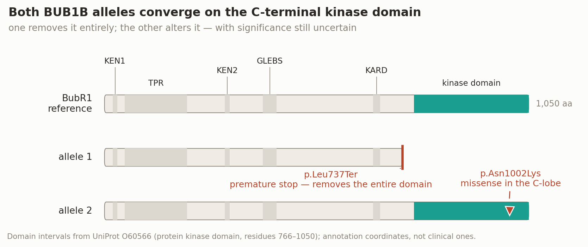
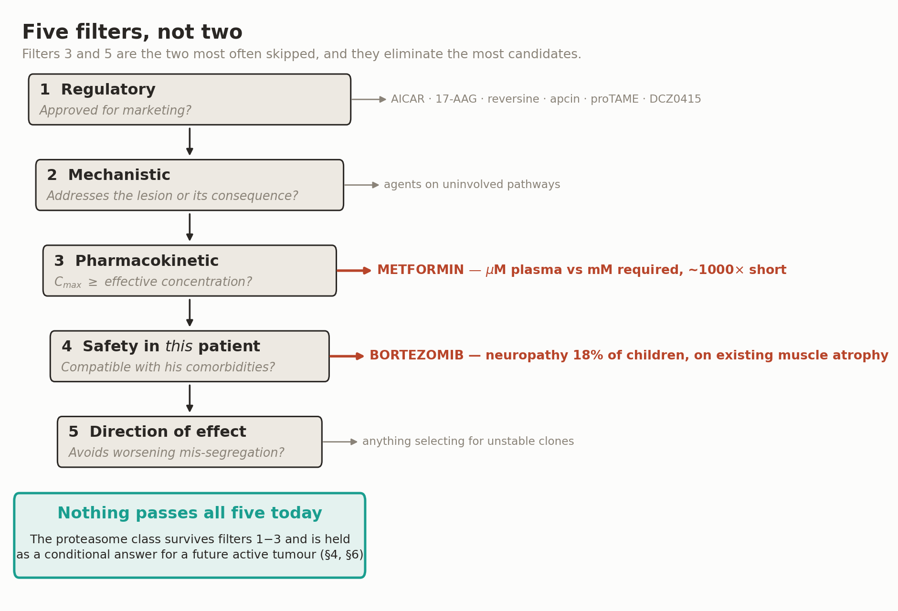
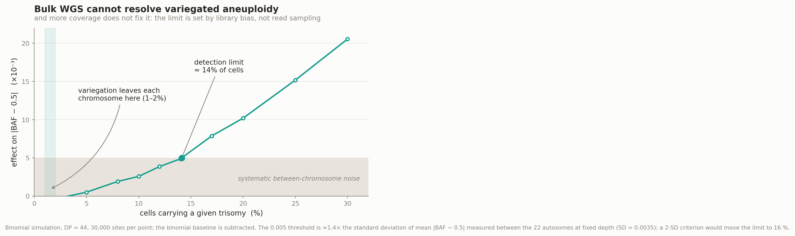

# Track 2 — Drug Repurposing for MVA1 (BUB1B compound heterozygosity)

**Team: ciberpty** · Rare Disease, Real Kid: MVA Hackathon 2026
Repository: https://github.com/cpu-16/mva-hackathon-2026 · Methods description: `methods_track2.md`

---

## Read this first — one page for the family and the treating team

*Plain-language summary, placed first on purpose. The rest of this report is written for scientists;
this page is written for the child's parents and for the clinician sitting with them. Every claim in it
is sourced in the sections that follow.*

### What we looked for

An existing, already-approved medicine that could help a child with mosaic variegated aneuploidy caused
by two changes in the *BUB1B* gene. We looked at every candidate the scientific literature points to,
and we set out in advance the tests a candidate had to pass.

### What we are **not** recommending

**No drug should be started for this today.** We want to be direct about that, because the honest answer
is more useful than an encouraging one.

- **Metformin** is the medicine most often suggested for this kind of problem. The dose a person can
  safely take does not reach anywhere near the concentration the proposed mechanism would need — roughly
  a thousandfold short. It should not be started on this reasoning. (§3.1)
- **Bortezomib** is a real, approved cancer medicine that acts on the specific weakness these cells
  have. It reaches the needed concentration. But it causes nerve damage in about 18 in 100 children who
  receive it, and this child already has muscle weakness. **Outside an active cancer, that trade is not
  worth making.** (§4)

### What can be done this month

| | Action | Why |
|---|---|---|
| 1 | **Confirm the child's current age** with the care team | Every schedule below depends on it, and we do not have it |
| 2 | **Renal ultrasound every 3 months, birth to age 7** | Published consensus recommendation for all forms of MVA (PMID 39264246) — not our idea, and not optional |
| 3 | **Regular full clinical examination**, including the orbit, skin and soft tissues | Rhabdomyosarcoma is not a kidney tumour and ultrasound will not find it. A 2026 case describes an MVA child whose second tumour appeared behind the eye at age 12 (PMID 42595739) |
| 4 | **Avoid unnecessary radiation**; keep HPV vaccination up to date | Consensus guidance for these disorders (PMID 39264246) |
| 5 | **Ask about testing and counselling for both parents** | The clinical notes mention repeated miscarriages. In 2026 that pattern was linked to carriers of *BUB1B* changes, who showed measurable chromosome abnormalities in a blood test (PMID 42434306). This is a hypothesis, not a diagnosis — but it is a simple test, and it bears on any future pregnancy (§7) |

### What would change the answer

If a new tumour appears, the question changes from "should he take a medicine" to "which medicines
belong in the treatment plan". At that point bortezomib becomes worth putting to a tumour board, because
the comparison is no longer against nothing — it is against chemotherapy that carries its own harms.
**It would not replace standard treatment.** It would be a question to ask, backed by the evidence in §3
and tested first in the laboratory experiment in §6.

We have written that answer down now so that nobody has to assemble it in a hurry later.

### What we are not certain about

The strongest evidence for this medicine comes from cancer patients, not from children with MVA. Whether
the same weakness exists in this child's cells is genuinely unknown, and §6 describes an experiment that
could show us we are wrong. We would rather say that plainly than overstate what we have.

---

---

## Executive summary

We applied five filters to candidate drugs rather than the usual two, and the third one changes the
answer.

The candidate the literature points to is **metformin**. It descends from the AICAR hit in the
aneuploidy-selective screen of Tang et al. (PMID 21315436), it is approved, and its mechanism is
plausible. It fails on pharmacokinetics: plasma concentrations at therapeutic doses are
**micromolar**, while complex I inhibition requires **millimolar** (PMID 37343530) — an
gap of roughly **three orders of magnitude (~1000-fold)**. We expect metformin to be widely proposed in this
track. **It cannot inhibit complex I at therapeutic plasma concentrations.** Whether it could still
stress aneuploid cells through AMPK activation at those concentrations is a *different* claim, and an
untested one: no study reports a metformin aneuploidy-selective effective concentration. We reject it
as unevaluable on the mechanism it is proposed for, not as disproven — the distinction is set out in §3.1.

The candidate that survives the pharmacology is **bortezomib**. Aneuploid cells carry a stoichiometric protein
imbalance and compensate by increasing protein degradation, which makes them **preferentially
dependent on the proteasome**. Ippolito et al. (2024, *Cancer Discovery*, PMID 39247952) established
this across multiple diploid-versus-aneuploid models, recapitulated it in hundreds of cancer cell
lines and primary tumours, and found that **aneuploidy level was significantly associated with the
response of multiple myeloma patients to proteasome inhibitors** — a human clinical association
rather than a pure cell-culture inference.

We state the size of the remaining leap rather than hide it. That evidence is drawn from **cancer**
aneuploidy, and myeloma is a plasma-cell neoplasm carrying its own immunoglobulin-driven proteotoxic
load. Whether the same dependency holds in **constitutional, variegated** aneuploidy is an
extrapolation, and it is exactly what the experiment in §6 is designed to break (an eight-week assay window; about twelve weeks from a fresh biopsy).

Bortezomib clears the pharmacokinetic filter with margin: EC50 in highly aneuploid lines is below
**40 nM**, while the approved 1.3 mg/m² IV dose reaches a Cmax of **89–120 ng/mL = 231–312 nM** — a
ratio of **5.8–7.8**. We quote the whole label interval rather than its ceiling; read it as an
order-of-magnitude margin, not a measured number.

It then fails our fourth filter, and we say so plainly: **not for this child, not now.** Bortezomib
causes peripheral neuropathy in 18% of paediatric patients (8% motor), and this child already has
skeletal muscle atrophy. Outside an active malignancy that risk-benefit does not hold.

**What remains is a specific and actionable proposition.** Bortezomib does not repair the lesion —
nothing restores BubR1 function — but it is the agent that exploits the best-characterised
*consequence* of that lesion, and it is the one worth having ready for an MVA patient **with an
active tumour**, where the comparator is not "no drug" but conventional cytotoxic chemotherapy. This child is an embryonal rhabdomyosarcoma survivor with a
high risk of embryonal tumours (PMID 28553959) — and he has already had one. That sequence is not
hypothetical: a 2026 case report describes a girl with MVA3 who had a Wilms tumour at three and an
orbital embryonal rhabdomyosarcoma at **twelve** (PMID 42595739). Our contribution is to have the
answer ready — with its evidence, its concentration margin and its stopping rule — before the
decision has to be made under pressure.

We also flag an antagonism a combination-minded team could walk into: **mTOR inhibitors would be
expected to protect aneuploid cells from proteasome inhibition, not synergise** (PMID 31530568).

---

## 1. The variants and what they break

The proband is compound heterozygous in `BUB1B` (NM_001211.6, transcript ENST00000287598.11, MANE):

| Variant | Consequence | Exomiser ACMG | ClinVar |
|---|---|---|---|
| `c.2210T>G` p.(Leu737Ter) | stop_gained | PATHOGENIC (PVS1, PM2_Supporting, PP4_Moderate, PP5_Strong) | 533901 — Pathogenic/Likely pathogenic |
| `c.3006T>G` p.(Asn1002Lys) | missense | UNCERTAIN_SIGNIFICANCE (PM2_Supporting, PP4_Moderate, BP1) | **not present** |

Population frequency depends on the source, and we report both rather than select the lower one.
Exomiser's gnomAD snapshot gives **9.98×10⁻⁵** (exomes, NFE) for the nonsense and **9.0×10⁻⁷** for the
missense; Ensembl VEP returned 3×10⁻⁵ and no record respectively. Both are rare; neither is absent.

**A note of caution on the missense.** ClinVar holds `c.3006T>A`, a *different* nucleotide substitution
producing the same p.Asn1002Lys, classified VUS. That classification does not transfer to our allele:
PS1 applies when the known same-amino-acid variant is pathogenic, and here it is uncertain. Our
variant is simply not in ClinVar.

BubR1 is a core component of the mitotic checkpoint complex and of kinetochore–microtubule attachment
control; biallelic *BUB1B* mutation was the founding cause of constitutional aneuploidy with cancer
predisposition (Hanks 2004, PMID 15475955), and BubR1 insufficiency in mice produces the progeroid
phenotype that makes MVA an aging syndrome as well as a cancer syndrome (PMID 15208629).

**p.Leu737Ter** truncates in the linker N-terminal to the C-terminal kinase fold — UniProt O60566
annotates the protein kinase domain at residues **766–1050** — removing it entirely, about 313 of the
protein's 1050 residues. (Whether BubR1 is catalytically active in humans is contested; we call it
the kinase domain because that is the current UniProt annotation, and our argument rests on the
truncation, not on catalysis.) It lands 16 residues upstream of **BUBR1^X753**, a characterised
truncating MVA allele (PMID 31738183) — very nearly the same truncation, not merely a related model.

**p.Asn1002Lys** falls inside that same domain, in its C-lobe, outside KEN, TPR and GLEBS, and
introduces a positive charge. **No published functional assay of this substitution exists.**

**The closest characterised missense sits ten residues away, and the mouse work on it carries a
warning for us.** Sieben et al. modelled the human MVA missense **BUBR1^L1012P** in mice and paired it
with **BUBR1^X753** — the same truncating-plus-missense architecture as our proband, with the missense
in the same domain. Those `BubR1^X753/L1012P` animals **died prematurely**; the viable genotype paired
the missense with a *hypomorphic* allele that still yields some wild-type protein (PMID 31738183).

Our proband is alive carrying a truncating allele. If that result transfers, it constrains
p.Asn1002Lys: **it would have to retain more residual function than L1012P does** — a hypomorph
rather than a functional null. That is a falsifiable prediction about our own VUS, and the
allele-fate arm of the experiment in §6 tests it directly.

Whether the truncated transcript escapes nonsense-mediated decay is unmeasured, and should not be
asserted either way without patient RNA.

At the cellular level, cell lines derived from MVA patients with biallelic mutations show "an
impaired mitotic checkpoint, chromosome alignment defects, and low overall BUBR1 abundance"
(PMID 20516114). BubR1 binds the B56 family of PP2A regulatory subunits through a
conserved motif phosphorylated by Cdk1 and Plk1, and counteracts Aurora B at improperly attached
kinetochores (Kruse et al., *J Cell Sci* 2013, PMID 23345399); the same B56 partnership opposes
Aurora B to give stable kinetochore–microtubule attachment (Xu et al., *Biol Open* 2013,
PMID 23789096). The region is commonly called KARD, a name neither source uses.

---

## 2. Five filters, not two

Repurposing exercises usually apply two filters: **is it approved?** and **is the mechanism
plausible?** Both are necessary; neither is sufficient. Three more decide the outcome.

| # | Filter | Question | What it eliminates here |
|---|---|---|---|
| 1 | Regulatory | Approved for marketing? | AICAR, 17-AAG, reversine, apcin, proTAME, DCZ0415 |
| 2 | Mechanistic | Does it address the actual lesion or a direct consequence of it? | Agents acting on uninvolved pathways |
| 3 | **Pharmacokinetic** | **Is Cmax ≥ the effective in vitro concentration?** | **Metformin (~1000-fold short)** |
| 4 | Patient-specific safety | Compatible with *this* child's comorbidities? | **Bortezomib, at present** |
| 5 | Direction of effect | Does it avoid increasing mis-segregation in survivors? | Anything selecting for unstable clones |

Filters 3 and 5 are rarely applied and eliminate the most candidates. Filter 3 is a possibility check,
not a demonstration of efficacy: it ignores protein binding, exposure duration and tissue penetration,
and a transient post-bolus Cmax can overstate useful exposure.

---

## 3. Applying the filters

### 3.1 Metformin fails on pharmacokinetics

The chain of reasoning is genuinely attractive and we followed it to the end. Tang et al. screened
isogenic trisomic mouse fibroblasts and found selective sensitivity to **AICAR**. AICAR is not
approved, so it fails filter 1. Metformin is the marketed stand-in that also produces AMPK activation
through complex I inhibition, and it is labelled in paediatrics from age 10. It passes filters 1 and 2.

It fails filter 3 decisively. Sakellakis (2023, PMID 37343530):

> *"the plasma concentration of metformin remains within the micromolar range when administered at
> therapeutic doses. While millimolar concentrations are necessary to inhibit complex I activity in
> isolated mitochondria, there is no evidence supporting the idea that metformin accumulates within
> the mitochondria."*

Fontaine (2018, PMID 30619086) reviews why that inhibition remains unsettled — that review exists to
"gather arguments for and against each hypothesis." In paediatrics the gap widens: dose-normalised
plasma exposure varies **3.3-fold** between children, and **"renal clearance was higher in children
compared to the reported data in healthy adults"**, with eGFR significantly affecting oral clearance
(PMID 42399684). Metformin is renally cleared, so this child's nephrocalcinosis makes renal function
the parameter that would have to be established first — the source links clearance to eGFR, not to
nephrocalcinosis specifically, and we do not stretch it further.

**The distinction that decides this, stated precisely.** Therapeutic metformin *does* activate AMPK in
patients — that is the diabetes literature and we do not dispute it. What the micromolar-versus-millimolar
gap rules out is the **complex I route at plasma concentrations**. Tang's screening hit was AICAR, a
direct AMPK agonist, so an AMPK-mediated aneuploidy-selective effect of metformin is not excluded by
this argument; it is simply **untested**. No study reports a metformin aneuploidy-selective effective
concentration, and the one paper reproducing AICAR's selectivity in human cells does not test metformin.
We therefore reject metformin as **unevaluable on the mechanism it is proposed for**, not as disproven —
and we say which of the two we mean, because they license different next steps: the first is answered by
an experiment, the second would close the question.

**We do not reject metformin out of caution. We reject it with a number — and we state what kind of
number it is.** For bortezomib, filter 3 is a true `Cmax / EC50` ratio against an EC50 measured in an
aneuploidy-stratified model. For metformin no such EC50 exists: no published study gives an
aneuploidy-selective effective concentration. AICAR's aneuploidy selectivity has in fact been reproduced in human cells — a trisomy-7 colonic line is fourfold more sensitive to AICAR than its isogenic diploid counterpart (PMID 22890317). That paper does not test metformin, and no published study gives metformin an aneuploidy-selective effective concentration at all. The 1000-fold figure is
therefore a comparison between *concentration ranges* — micromolar plasma against millimolar complex I
inhibition — not the same quantity as the bortezomib ratio. It is a coarser instrument, and it still
points the same way.

There is a deeper objection, and stating it accurately matters. Tang et al. did **not** restrict
themselves to stable trisomies: Figure 6 of that paper tests AICAR and 17-AAG in *Bub1b*^H/H
hypomorphic MEFs and in *Cdc20*^AAA cells — genuine ongoing-instability models with a weak
checkpoint. So the screen does reach beyond a fixed extra chromosome.

What it does not reach is **metformin**, which is not tested in those models, and human biallelic
BUB1B cells, which are not tested at all. The gap is therefore narrower and more specific than "stable
trisomies only": the marketed stand-in was never evaluated in the instability models, and a mouse
*Bub1b*^H/H hypomorph is not equivalent to human p.Leu737Ter/p.Asn1002Lys.

### 3.2 Bortezomib passes filters 1–2, and clears filter 3 on total-drug exposure

**Mechanism.** Aneuploidy imposes a stoichiometric imbalance of protein complexes. Ippolito et al.
(2024, PMID 39247952) dissected multiple diploid-versus-aneuploid models and found that aneuploid
cells mitigate proteotoxic stress by reducing translation and **increasing protein degradation**,
rendering them more sensitive to proteasome inhibition. The finding was recapitulated across hundreds
of human cancer cell lines and primary tumours.

**An independent, orthogonal 2026 result points at the same target.** Paired genome-wide CRISPR
loss-of-function screens in isogenic aneuploid versus near-euploid lines identify **proteasome subunits**
among the top aneuploid-specific dependency gene groups, alongside ribosome and rRNA processing,
spliceosome and mitochondrial metabolism; a focused druggable-genome arm nominates the ubiquitin-conjugating
enzyme **UBE2H** as a top aneuploid-selective dependency (PMID 42094535). This is genetic loss-of-function
evidence rather than pharmacology, arrived at by a different method than Ippolito's, and it converges on the
ubiquitin–proteasome axis. **It is a preprint (bioRxiv) and not yet peer-reviewed**, so we weight it as
corroboration, not as a second pillar. UBE2H itself has no approved inhibitor and therefore fails filter 1
today; we record it in §9 as the target to watch.

The clinically important sentence in that paper is the last one: **aneuploidy level was significantly
associated with the response of multiple myeloma patients to proteasome inhibitors.** That is a human
signal linking degree of aneuploidy to response to this drug class, which is more than most
repurposing arguments have.

**We state the size of that clinical signal rather than let a reviewer find it.** It rests on small
cohorts: with bortezomib as a single agent, 8 patients with a complete response had significantly
higher aneuploidy scores than 50 with progressive disease (p = 0.014, one-tailed Mann-Whitney); in a
bortezomib-plus-chemotherapy-and-dexamethasone cohort, 13 complete responders versus 14 minimal
responders (p = 0.038); a third cohort trended the same way but had only 2 non-responders. That is a
genuine human association built on small numbers — enough to justify running an experiment, not
enough to predict an individual patient's response.

It is also not evidence about MVA1. Myeloma is a plasma-cell neoplasm whose immunoglobulin output
imposes a proteotoxic load of its own, and its aneuploidy is clonal, not variegated. MVA1 is a
constitutional aneuploidy state — a *different* setting in which the same dependency is plausible and
untested. We treat the myeloma association as the reason to run the experiment, not as its result.

**The numbers.**

| | Value | Source |
|---|---|---|
| EC50 in highly aneuploid lines (72 h) | **< 40 nM** — conservative upper bound read from Fig. 6o (5 near-euploid vs 5 highly aneuploid cancer lines, p = 0.0317, Mann-Whitney); the figure legend reports no numeric EC50 values, so this is read off the plot | PMID 39247952 |
| Cmax, 1.3 mg/m² IV, repeated dosing | **89–120 ng/mL = 231–312 nM** (label interval; we quote both ends) | FDA label, NDA 021602 s040, §12.3 |
| Cmax, subcutaneous route | 20.4 ng/mL = 53.1 nM | same |
| **Filter 3 ratio (IV)** | **5.8 – 7.8** | — |

We use the upper bound of the EC50 range, and we do not treat the 2.4 nM apoptosis figure from the
same paper as an EC50.

**The subcutaneous route does not pass, and we withdraw the claim that it does.** Its nominal ratio is
1.33 on *total* drug, and bortezomib is extensively protein-bound, so free concentration is a fraction
of total Cmax. A margin of 1.33 does not survive that correction. Only the IV route clears filter 3 —
and even there, the ratio is computed on total drug, which is the acknowledged weakness of the filter
(§2).

### 3.3 Everything else: not evaluable, and we say so

| Drug | Filter 3 verdict | Why |
|---|---|---|
| Carfilzomib | **Not evaluable** | No published IC50 in an aneuploidy-stratified model; Ippolito used bortezomib and MG132. Cmax is known (2.89 µM at 56 mg/m²) but there is no valid denominator |
| Ixazomib | **Not evaluable** | Same gap. The β5 enzymatic IC50 (3.4 nM) is not a cellular aneuploidy-selective value |
| Hydroxychloroquine | **Not evaluable, and mechanistically weakened** | Tang's hit was *chloroquine*, not HCQ — and chloroquine did **not** differentially inhibit the human CIN lines in that same paper |
| Everolimus / sirolimus | **Not evaluable, and possibly counterproductive** | See §3.4 |

Substituting an IC50 from an unstratified tumour line would manufacture a ratio without meaning. We
leave those cells empty rather than fill them.

### 3.4 The antagonism nobody should walk into

A team building a combination might reach for an mTOR inhibitor alongside a proteasome inhibitor:
both touch protein homeostasis, so synergy feels intuitive. The evidence points the other way.

Aneuploid and CIN cells are vulnerable to proteasome inhibition **because** they carry a translational
burden. Reducing protein synthesis relieves that burden — and the ovarian carcinoma work shows
exactly that mechanism operating as *resistance*. Ovarian cancer cells kept their sensitivity to
proteasome inhibitors in adherent culture but **"acquired resistance as spheroids … by downregulating
protein synthesis via mTORC1 suppression"**; conversely, PTEN loss drove constitutive mTORC1 activity
and **resensitized** the spheroids to proteasome inhibition, in vitro and in vivo (PMID 31530568).

Two boundaries on that evidence, since we are the ones importing it. It is ovarian carcinoma
spheroids, not constitutional aneuploidy. And the paper did **not** test rapalogues — the antagonism
below is our inference from its mechanism, not its result.

**The objection this raises against our own candidate, stated before a reviewer does.** The same
paper notes that this protective mechanism "may explain the overall poor response to bortezomib in
clinical trials of patients with advanced ovarian cancer." Bortezomib has therefore *failed* in at
least one solid-tumour setting, and any honest reading has to carry that. Our answer is that the
proposed failure mode is context-specific — a spheroid/ascites configuration suppressing translation
— and that the same paper identifies a responsive subpopulation defined by mTORC1 status. It is a
reason to measure the response in patient cells before believing it, which is what §6 does; it is
not a reason the mechanism is wrong.

**The premise of that prediction has independent 2025 support.** Work in yeast shows that chromosome
amplification drives premature aging through defects in ribosome quality control, that aneuploids carry
an increased load of protein aggregates and signs of ubiquitin dysregulation, and — the load-bearing
point for us — that the *increased translational load* is what accelerates the decline (PMID 41248159).
That is a different organism and an aging phenotype rather than a drug response, so we cite it for the
premise only: reducing translation relieves a burden these cells depend on carrying. It is also the
reason the same axis appears twice in this report with opposite signs, since MVA is itself a progeroid
syndrome (PMID 31738183).

**Prediction, stated so that it can be falsified:** everolimus or sirolimus would antagonise
bortezomib in aneuploid cells rather than potentiate it. Any screen should test that combination
explicitly and expect a negative interaction.

**A tension we flag rather than hide.** The same BubR1 mouse work reports that predisposition to
sarcopenia correlates with **mTORC1 hyperactivity** (PMID 31738183) — and this child has skeletal
muscle atrophy. So an independent, muscle-directed rationale for mTOR inhibition in MVA exists, and
it points the opposite way from our antagonism prediction. The two are not strictly in conflict: one
concerns proteotoxic killing of aneuploid cells, the other a progeroid muscle phenotype. But anyone
testing the combination should know both exist, and should not read a muscle-directed mTOR rationale
as support for pairing it with a proteasome inhibitor.

---

## 4. Filter 4: safety in *this* child — where the candidate stops

Bortezomib clears the pharmacology. It does not clear this patient today.

| Concern | Data | Relevance here |
|---|---|---|
| **Peripheral neuropathy** | 25/140 (18%) of paediatric patients, motor neuropathy 11/140 (8%) (FDA BPCA Clinical Review, NDA 021602, 2015). In adults, grade ≥2 in 39% and grade ≥3 in 15% by IV route (FDA label, NDA 206927 s002, 2022 — a different source from the PK figures above) | This child has **skeletal muscle atrophy** (HP:0003202). Superimposing a motor neuropathy on reduced neuromuscular reserve is the decisive objection |
| Thrombocytopenia, neutropenia, infection | FDA label | Prior chemotherapy for ERMS; marrow reserve unknown |
| Gastrointestinal toxicity, hypotension | FDA label | **Failure to thrive** (HP:0001508) — anything suppressing intake is costly |
| Renal | PK not clinically altered by renal impairment per label | **Nephrocalcinosis** (HP:0000121) still requires renal function, hydration and electrolytes to be established first |

**Bortezomib is therefore not proposed as prophylaxis or as chronic therapy for this child.**

**But filter 4 is patient-specific, not universal — and that is the point.** For a patient with MVA
**and an active malignancy**, where cytotoxic therapy is on the table regardless and the comparator is
conventional chemotherapy rather than nothing, the balance inverts. In that setting a proteasome
inhibitor is not an exotic addition: it is an approved agent that targets the best-characterised
downstream consequence of the underlying lesion — proteotoxic dependency — supported by a human
clinical signal tying response to aneuploidy burden. It does not correct the checkpoint defect, and
we do not claim it does.

This child survived an embryonal rhabdomyosarcoma, and the risk is gene-specific: "individuals with
biallelic TRIP13 or BUB1B mutations have a high risk of embryonal tumors" (PMID 28553959), and an
E-RMS arising in an MVA case with biallelic BUB1B has been characterised directly (PMID 16182441). **The realistic clinical question is not "what do we give him
today" but "what do we reach for if there is a second tumour" — and that question deserves an answer
prepared in advance, with its evidence and its threshold, rather than improvised under pressure.**

There is a second, immediate implication. Spindle poisons — vincristine, taxanes — depend on a
competent mitotic checkpoint. With reduced BubR1 that arrest is less robust; a case of rhabdomyosarcoma with PCS/MVA treated with
**reduced-intensity chemotherapy** is on record (PMID 31184400 — a single case, not a guideline and
not a safety estimate; PubMed carries no abstract for it, so we cite only what its title states and
do not name the regimen). This is a **relative**
contraindication weighed against probability of cure, never a reason to withhold curative therapy. If
a mitotic-poison-sparing regimen is ever needed, there is **no validated replacement agent**: a
proteasome inhibitor would be a bench hypothesis to test first, not a substitution anyone could make
at the bedside.

We state the boundary explicitly: this is a hypothesis for a tumour board, not a prescription.

---

## 5. Why any endpoint must be measured per cell

Any trial of the above needs a readout for **aneuploidy burden**. We asked whether the data this
hackathon provides could supply one, and computed the answer instead of asserting it.

**We are not proposing a new assay.** The correct endpoints exist and are standard: metaphase
karyotyping with premature chromatid separation scoring is the diagnostic criterion for MVA; the
micronucleus assay is an international standard (OECD TG 487); and single-cell DNA sequencing has
been used to assay chromosome copy number genome-wide since Knouse et al. 2014 (PMID 25197050). We
cite that work for the method, not for our conclusion — its own finding is that aneuploidy is *rarer*
in liver and brain than previously reported.

What we contribute is the number.

The analysis used the **VCF only** — no BAM, hence no GC-LOESS normalisation. Four analyses were run,
of which three are refinements of the same B-allele-frequency statistic and one (depth-based dosage)
is orthogonal; they are not four independent tests. In a trisomy, heterozygous sites split
symmetrically, so the *mean* BAF does not move and the correct statistic is mean |BAF − 0.5|.

The measured standard deviation of mean |BAF − 0.5| across the 22 autosomes at fixed depth
(DP 40–48, 857,435 sites) is **0.0035**, so the 0.005 noise floor we use — arising from GC content,
mappability and segmental duplications — is a ≈1.4-SD criterion. Simulating at DP 44 against it gives
a **practical detection limit of a clonal whole-chromosome trisomy present in ~14% of cells**; a
conventional 2-SD criterion moves it to 16% and 3-SD to 20%. Every stricter choice makes the assay
look worse, so the conclusion does not rest on the threshold.

**Read sampling is not what sets that limit.** The simulation subtracts the binomial baseline at
DP 44, so the 0.005 threshold a signal must clear is the *measured dispersion between chromosomes* —
systematic library bias, not counting noise. The depth-based dosage test points the same way by a
separate route: Poisson error when averaging a whole chromosome at 44× is ~0.03%, far below the
observed deviations. These are two different statistics and we do not conflate them; both imply that
sequencing deeper would barely move the limit.

As an **illustrative bound, not a measurement of this child**: if 30% of cells were aneuploid — the
order of magnitude of the diagnostic criterion, not a figure from this patient — spread across 22
autosomes, each chromosome would be affected in **1–2% of cells**, and gains and losses of the same
chromosome cancel in bulk. That sits **7–16× below** the 14–16% limit. And **bulk averaging erases variegation by
construction**, at any depth. The cytogenetic hallmark of MVA, premature chromatid separation, leaves
no trace in DNA sequence at all.

Every candidate signal we did observe traced to coverage, to segmental duplications (22q11,
centromeres), or partially to GC content — partially, because our measured GC–coverage correlation was
r = 0.43 from a sparse sample, and chr21, the largest deviation, is GC-poor. That is an insufficient
measurement rather than an established explanation, and we report it as such.

**Consequence:** no proposal whose endpoint is "reduced aneuploidy burden" can be evaluated with these
data. Any screen must measure per-cell mis-segregation.

---

## 6. The go/no-go experiment — an eight-week assay window

Scoped to be executable by one laboratory in one window, not as a grant application.

**Question.** Are BUB1B-deficient patient cells preferentially sensitive to bortezomib at clinically
achievable concentrations, and does that sensitivity come without increasing mis-segregation among the
survivors?

**What this experiment can and cannot decide, stated first.** Dermal fibroblasts from this child are
*constitutional* MVA cells, not tumour cells. A sensitivity difference between them and unaffected
controls therefore measures whether the proteotoxic dependency transfers from cancer aneuploidy to
constitutional aneuploidy at all — it does **not** measure tumour selectivity, and on its own it is as
compatible with systemic toxicity as with therapeutic promise. That is why the go criterion below is
*not* "patient cells are more sensitive". It is also why §5 matters here: variegation leaves each
chromosome affected in 1–2% of cells, so a fibroblast population may simply not be aneuploid enough to
express a dependency that Ippolito measured in *highly* aneuploid lines. **A negative result is therefore
ambiguous by design** — it fails to support transfer, but it does not close the tumour-board question,
which would need aneuploidy-high tumour-derived material. We say this now rather than after the data.

| Week | Step | Readout |
|---|---|---|
| 1–3 | Patient dermal fibroblasts from skin biopsy, plus two matched controls. **Patient cells are required:** RPE1 with reversine-induced aneuploidy reproduces Ippolito's own system and cannot test whether the dependency transfers to BUB1B-deficient constitutional MVA — we list it as a positive control, not a substitute. Without patient cells the go/no-go question is not answerable | Growth; baseline karyotype |
| 2–4 | Allele fate: allele-specific RT-PCR ± NMD inhibitor; quantitative western blot with N- and C-terminal antibodies | N+/C− band implies truncation; loss of both implies NMD |
| 4–6 | Bortezomib dose–response, **0–400 nM** with dense sampling below 100 nM, 72 h, patient versus control versus an aneuploidy-high positive control (reversine-treated RPE1) | EC50 and the ratio between them. The range spans the 312 nM clinical Cmax so the advancement threshold falls inside the data |
| 4–6 | **Combination arm: bortezomib + everolimus** | Tests the predicted antagonism |
| 6–8 | **Micronucleus assay (OECD TG 487)** on survivors of every condition, plus FISH for 3–5 chromosomes | Mis-segregation rate — filter 5 |

**Timeline, stated honestly in the heading it belongs in.** Eight weeks is the *assay* programme, and it
holds only once a patient fibroblast line exists. Establishing 15–20 × 10⁶ fibroblasts from a fresh
biopsy typically takes 4–8 weeks on its own, so from a standing start the realistic figure is
**about twelve weeks**, not eight. We use "eight-week experiment" as shorthand for the assay window and
nowhere as a promise of a twelve-week answer.

**Advancement criteria, fixed before the data.** We state them in the direction that avoids rewarding
toxicity:

1. **A dependency signal, not merely a sensitivity difference:** an EC50 shift between patient and
   control fibroblasts whose 95% confidence interval excludes 1, of a magnitude at least equal to the
   near-euploid-versus-highly-aneuploid contrast in Ippolito Fig. 6o. A shift smaller than that is not
   the effect we predicted.
2. **Effect at ≤312 nM**, the upper end of the clinical Cmax interval.
3. **No increase in micronuclei among survivors** — filter 5.
4. **A stop signal, not a go signal:** if patient fibroblasts are markedly more sensitive than controls
   *without* the aneuploidy-high positive control showing a larger shift still, the most likely reading
   is constitutional toxicity in an MVA patient rather than selective killing of aneuploid cells. That
   outcome stops the programme too, and it is the outcome we would most easily have mistaken for
   success.

Failing any of 1–3, or triggering 4, stops the programme.

**Falsifying results.** If patient fibroblasts are no more sensitive than controls, the proteotoxic
dependency does not transfer from cancer aneuploidy to constitutional MVA. If bortezomib raises
micronucleus frequency among survivors, it fails filter 5 regardless of how well it kills.

This design can fail, which is the point of proposing it.

---

## 7. Actionable now, without any drug

The intervention that most changes this child's prognosis today is not a molecule.

**There is a published consensus for MVA specifically, and it should be the anchor.** The 2024 update
from the AACR Childhood Cancer Predisposition Workshop covers mosaic variegated aneuploidy by name and
states: *"This group recommended renal ultrasound surveillance every 3 months from birth until age 7,
for all MVA conditions including those with an unknown genetic cause"*, together with *"regular clinical
assessment including review of systems to identify signs of rhabdomyosarcoma and other malignancies"*,
avoidance of radiation exposure, and HPV vaccination (PMID 39264246). The same source records that
cancers in MVA1 are *"predominantly Wilms tumor and rhabdomyosarcoma, but MDS, AML and ALL have also
been reported"*.

We had reached the 3-monthly-to-age-7 schedule independently, by extension from UK Wilms-risk
recommendations that stop at age 5 (PMID 16857697). We report that convergence rather than our
derivation: **the schedule below is consensus guidance, not our inference**, and a family should be
given it as such.

**Where the consensus leaves a gap, and it is the gap that matters for this child.** The window closes
at seven. A 2026 case report describes an MVA3 girl whose Wilms tumour appeared at three and whose
orbital embryonal rhabdomyosarcoma appeared at **twelve** (PMID 42595739) — five years past the end of
renal-ultrasound surveillance, at a site renal ultrasound does not image. Renal ultrasound is a
kidney-directed test; rhabdomyosarcoma is not a kidney tumour, which is why the consensus pairs it with
clinical assessment rather than with imaging. For a child who has *already had* an embryonal
rhabdomyosarcoma, we therefore propose that the clinical-examination arm continue past seven, and we
mark it as our extension rather than as guidance.

**Surveillance windows must be anchored to the child's current age, which is not in the dataset and
must be confirmed before use. If the age is unknown, that is the first thing to establish — nothing
below is actionable without it.** This is a discussion framework for an expert cancer-predisposition
clinic, not a substitute for one:

| Period | Surveillance | Frequency |
|---|---|---|
| Birth to age 7 | Renal ultrasound (we suggest extending the field to liver, retroperitoneum and pelvis) | Every 3 months — **consensus recommendation for all MVA conditions** (PMID 39264246). The wider abdominal field is our addition |
| To age 10, then reviewed | Full paediatric and oncological examination: abdomen, nodes, head and neck, **orbit**, skin, genitalia, soft tissues | 3-monthly to age 7, then 6-monthly. The consensus asks for clinical assessment for rhabdomyosarcoma without setting an end date; continuing past 7 is **our extension**, prompted by the age-12 orbital ERMS in PMID 42595739. Catches superficial ERMS that renal ultrasound cannot |
| Post-ERMS | Relapse follow-up per tumour protocol | Coordinate to avoid duplicate imaging |
| Through childhood | Full blood count with differential | 6-monthly is reasonable given reported leukaemia, but **no evidence of benefit exists** |
| Lifelong | Family education; annual predisposition clinic | Urgent review for mass, haematuria, abdominal distension, persistent pain, neurological deficit, bleeding or weight loss |

If the child is already past 7, missed scans should not be "caught up": a baseline assessment and an
individualised decision by the predisposition team is the right course.

We do **not** propose serial AFP, repeat CT, PET-CT or routine whole-body MRI while asymptomatic — no
demonstrated benefit in MVA, weighed against sedation, false positives, cost and radiation. The
consensus is explicit that **radiation exposure should be avoided** in these disorders (PMID 39264246),
which is an argument against imaging-heavy surveillance and, separately, a consideration for any future
treatment plan.

**One implication for the parents, which the phenotype document already hints at.** The clinical
document lists recurrent spontaneous abortion (HP:0200067) — an obstetric history, not a feature of the
child. Both parents are obligate heterozygous carriers. A 2026 study of two unrelated families with
unexplained recurrent pregnancy loss identified novel heterozygous *BUB1B* variants and found
**significantly elevated premature chromatid separation rates in the carriers' lymphocytes** by G-banding
and centromere FISH, with a trend toward reduced BUBR1 (PMID 42434306). Those variants were classified
VUS and the cohort is two families, so this is a hypothesis, not a finding about this family. But it is
cheap to act on and it is squarely in the family's interest: a PCS assay on parental lymphocytes and
formal genetic counselling would test whether the miscarriage history is itself part of the carrier
phenotype, and would inform any future pregnancy. **Nothing else in this report can be acted on this
month; this can.**

---

## 8. What we do not propose

- **MPS1/TTK inhibitors and reversine** — not approved, and they weaken a checkpoint that is already
  insufficient. Reversine is a research tool for *inducing* aneuploidy, the opposite of the goal.
- **Apcin, proTAME** — APC/C tool compounds, not marketed.
- **DCZ0415** — experimental TRIP13 inhibitor: wrong gene, not approved.
- **AICAR and 17-AAG** — genuine hits in the Tang screen, neither marketed. Useful as in vitro
  positive controls only.
- **Metformin** — fails filter 3 by roughly 1000-fold, as set out in §3.1.
- **Senolytics** — the BubR1 senescence evidence rests on *genetic* clearance of p16^Ink4a+ cells via
  the INK-ATTAC transgene (PMID 22048312), which is not a transferable drug; no agent is approved with
  a senolytic indication; and senescence is an anti-tumour barrier worth preserving in a
  cancer-predisposition syndrome.
- **mTOR inhibitors combined with proteasome inhibition** — predicted antagonism (PMID 31530568).
- **Bortezomib for this child today** — fails filter 4, as set out in §4.

---

## 9. Scalability

- The **five-filter framework**, particularly filters 3 and 5, applies to any repurposing exercise in
  any rare disease. It is the transferable product of this work.
- **The MVA genes are not interchangeable.** MVA2 arises from biallelic *CEP57* (PMID 21552266) and
  behaves differently from MVA1 and MVA3 on exactly the axis that matters here — see the CEP57 caveat below.
- The **proteotoxic vulnerability**, *if* §6 shows it transfers, would extend most plausibly to
  **TRIP13**-related MVA, which shares both the tumour risk and the severity of checkpoint failure:
  "individuals with biallelic TRIP13 or BUB1B mutations have a high risk of embryonal tumors …
  their cells display severe SAC impairment" (PMID 28553959) — and the 2026 case in §7 is a TRIP13
  patient with two embryonal tumours (PMID 42595739). **It should not be assumed for CEP57.** Yost
  reports that CEP57-related MVA "is not associated with embryonal tumors" with cells showing "minimal
  SAC deficiency", and the 2024 consensus is blunter still: **"At the time of writing, none of the 15
  individuals with MVA2 described in literature developed cancer"** (PMID 39264246). Less
  mis-segregation should mean less proteotoxic burden, so the rationale is weaker there. No proteasome
  data exist for either, and §10 states that transfer to MVA1 itself is unproven.
- **The target to watch is UBE2H.** The 2026 paired CRISPR screens nominate it as a top
  aneuploid-selective dependency linked to mitochondrial proteostasis (PMID 42094535, preprint). It has
  no approved inhibitor, so it fails filter 1 today and is not a candidate — but it is where an
  aneuploidy-selective agent would most plausibly come from next, and a repurposing exercise repeated in
  two years should start there rather than at metformin.
- **A reusable worksheet** is included as the Appendix: the five filters as blank rows, with the
  metformin and bortezomib verdicts as the worked example, so a team working on a different rare disease
  can apply the framework without reading this report.
- The **gene panel** (BUB1B, CEP57, TRIP13, CENATAC, MAD1L1, MAD2L1BP, CEP192, BUB1, SMC5, TRIM37,
  CENPE) and the artefact controls used in the mosaicism analysis transfer to any MVA or PCS workup.
- The **micronucleus → scDNA-seq endpoint** applies to mitotic CIN disorders. It does **not** transfer
  to Fanconi anaemia or Bloom syndrome, whose diagnostic assays are DEB/MMC chromosome breakage and
  sister-chromatid exchange respectively — a different lesion, not substitutable.

---

## 10. Limitations

- **Phase is not established.** No parental samples, and the variants lie ~11 kb apart, beyond
  read-backed phasing for short reads. Two heterozygous variants in a singleton are a priori 50/50 cis
  or trans; rarity does not phase them. What supports *trans* is that the child is affected, that MVA1
  is recessive, that truncating-plus-missense is the recurrent pattern, and that the phenotype
  matches. It remains a diagnosis pending segregation.
- **p.Asn1002Lys has no functional assay**, and its apparent ClinVar entry is for a different
  nucleotide.
- **The bortezomib EC50 is a conservative upper bound** read from a figure panel rather than a
  tabulated value, and the Cmax is a label interval rather than a point estimate; the ratio of 5.8–7.8
  should be read as an order-of-magnitude statement computed on total, not free, drug.
- **Ippolito et al. studied cancer aneuploidy**, not constitutional variegated mosaicism. Whether the
  proteotoxic dependency transfers is precisely what the proposed experiment tests; we have not
  assumed it.
- **No trial specific to MVA1** was found in ClinicalTrials.gov, Open Targets, ChEMBL or CMap/LINCS.
  Absence of an interface result is not proof of absence.
- **The child's current age is unknown to us**, and the surveillance schedule depends on it.

---

## A closing note

The family of this child published their son's genome so that strangers might help. They will read
what comes back.

We have tried to write something useful rather than something reassuring. The honest answer to "what
drug should he take today" is none — and we show why the obvious candidate cannot work rather than
proposing it softly. The useful answer is a mechanism that matches his disease, an approved drug that
reaches the required concentration, an explicit statement of the condition under which it would become
appropriate, and an experiment that could rule it out in eight weeks.

That is not a cure. It is a prepared answer to a question this family may unfortunately have to ask.

---
---

## Appendix — The five-filter worksheet (reusable)

*The transferable product of this work. Blank rows for a new disease; the two decided rows as worked
examples. A candidate must pass all five. Filters 3 and 5 eliminate the most candidates and are the two
most often skipped.*

| Candidate | 1. Approved? | 2. Addresses lesion or a direct consequence? | 3. Cmax ≥ effective concentration? | 4. Safe in *this* patient? | 5. Does not worsen the underlying defect? | Verdict |
|---|---|---|---|---|---|---|
| **Metformin** | Yes (paediatric label from age 10) | Proposed via complex I → AMPK | **No — µM plasma vs mM required, ~1000× short; no aneuploidy-selective EC50 exists** | Renal clearance; nephrocalcinosis unassessed | Not reached | **Fails filter 3** |
| **Bortezomib** | Yes | Yes — proteasome dependency of aneuploid cells | Yes on total drug: 231–312 nM Cmax vs EC50 <40 nM (5.8–7.8×); IV only, not subcutaneous | **No — neuropathy in 18% of children, on pre-existing muscle atrophy** | No evidence it increases mis-segregation; to be tested | **Fails filter 4 for this child; conditional for a patient with an active tumour** |
| *(your candidate)* | | | | | | |
| *(your candidate)* | | | | | | |

**How to fill it in.** Filter 3 needs a real denominator: an effective concentration measured in a model
stratified for the disease mechanism. If none exists, write *not evaluable* — do not substitute an IC50
from an unrelated model, because that manufactures a ratio with no meaning. Filter 4 is patient-specific
by construction, so a "fail" here is a statement about one person and one moment, not about the drug.
Filter 5 asks the question repurposing exercises forget: among the cells that survive the drug, is the
underlying defect made worse?

---

## References

1. Hanks S, et al. Constitutional aneuploidy and cancer predisposition caused by biallelic mutations in *BUB1B*. *Nat Genet* 2004. PMID 15475955
2. Suijkerbuijk SJE, et al. Molecular causes for BUBR1 dysfunction in mosaic variegated aneuploidy. *Cancer Res* 2010. PMID 20516114
3. Hanks S, et al. Comparative genomic hybridization and BUB1B mutation analyses in childhood cancers associated with MVA. *Cancer Lett* 2006. PMID 16182441
4. Tang YC, et al. Identification of aneuploidy-selective antiproliferation compounds. *Cell* 2011. PMID 21315436
5. **Ippolito MR, et al. Increased RNA and Protein Degradation Is Required for Counteracting Transcriptional Burden and Proteotoxic Stress in Human Aneuploid Cells.** *Cancer Discov* 2024. PMID 39247952
6. **Sakellakis M. Why Metformin Should Not Be Used as an Oxidative Phosphorylation Inhibitor in Cancer Patients.** 2023. PMID 37343530
7. Fontaine E. Metformin-Induced Mitochondrial Complex I Inhibition: Facts, Uncertainties, and Consequences. 2018. PMID 30619086
8. Ailabouni AS, et al. Interindividual variability in metformin pharmacokinetics in pediatric patients. 2026. PMID 42399684
9. **Chui MH, et al. Chromosomal Instability and mTORC1 Activation through PTEN Loss Contribute to Proteotoxic Stress in Ovarian Carcinoma.** *Cancer Res* 2019. PMID 31530568
10. Knouse KA, et al. Single cell sequencing reveals low levels of aneuploidy across mammalian tissues. *PNAS* 2014. PMID 25197050
11. Baker DJ, et al. BubR1 insufficiency causes early onset of aging-associated phenotypes. *Nat Genet* 2004. PMID 15208629 — cited for the progeroid phenotype of BubR1 insufficiency underlying §3.4
12. Baker DJ, et al. Clearance of p16^Ink4a-positive senescent cells delays ageing-associated disorders. *Nature* 2011. PMID 22048312
13. Sieben CJ, et al. BubR1 allelic effects drive phenotypic heterogeneity in mosaic variegated aneuploidy. *J Clin Invest* 2020. PMID 31738183
14. Nishitani-Isa M, et al. ERMS with PCS/MVA treated with reduced-intensity chemotherapy. *Pediatr Int* 2019. PMID 31184400
15. Scott RH, et al. Surveillance for Wilms tumour in at-risk children: pragmatic recommendations. *Arch Dis Child* 2006. PMID 16857697
16. Xu P, et al. BUBR1 recruits PP2A via the B56 family to promote chromosome congression. *Biol Open* 2013. PMID 23789096
17. Kruse T, et al. Direct binding between BubR1 and B56-PP2A regulates mitotic progression. *J Cell Sci* 2013. PMID 23345399
18. Snape K, et al. Mutations in *CEP57* cause mosaic variegated aneuploidy syndrome. *Nat Genet* 2011. PMID 21552266
19. Yost S, et al. Biallelic *TRIP13* mutations predispose to Wilms tumor and chromosome missegregation. *Nat Genet* 2017. PMID 28553959
20. FDA label, VELCADE (bortezomib), NDA 021602 s040, §12.3
21. FDA BPCA Clinical Review, bortezomib paediatric safety, NDA 021602, 2015
22. Aneuploid human colonic epithelial cells are sensitive to AICAR-induced growth inhibition through AMPK. 2013. PMID 22890317
23. **Nakano Y, Kuiper RP, et al. Update on Recommendations for Cancer Screening and Surveillance in Children with Genomic Instability Disorders.** *Clin Cancer Res* 2024. PMID 39264246 — the MVA-specific surveillance consensus used in §7
24. **Schukken KM, et al. Paired CRISPR screens identify mitochondrial metabolism and UBE2H as aneuploid-specific dependencies in human cancer cell lines.** *bioRxiv* 2026 (preprint, not peer-reviewed). PMID 42094535
25. Vempuluru VS, et al. Sequential presentation of Wilms' tumor and orbital rhabdomyosarcoma in a child with mosaic variegated aneuploidy syndrome 3. *Orbit* 2026. PMID 42595739
26. Wei TY, et al. Functional and clinical evidence for two novel heterozygous *BUB1B* variants and their value in precision genetic counseling for recurrent pregnancy loss. *Front Endocrinol* 2026. PMID 42434306
27. Escalante LE, Hose J, et al. Chromosome duplication causes premature aging via defects in ribosome quality control. *PLoS Biol* 2025. PMID 41248159
